<p align="right">English | <a href="docs/CN.md">简体中文</a></p>

<p align="center">
  
  
  <h3 align="center"><strong>Towards Robust Bird's Eye View Perception under Common Corruption and Domain Shift</strong></h3>

  <p align="center">
      <a href="https://scholar.google.com/citations?user=s1m55YoAAAAJ" target='_blank'>Shaoyuan Xie</a><sup>1</sup>&nbsp;&nbsp;
      <a href="https://scholar.google.com/citations?user=-j1j7TkAAAAJ" target='_blank'>Lingdong Kong</a><sup>2,3</sup>&nbsp;&nbsp;
      <a href="https://scholar.google.com/citations?user=QDXADSEAAAAJ" target='_blank'>Wenwei Zhang</a><sup>2,4</sup>&nbsp;&nbsp;
      <a href="https://scholar.google.com/citations?user=YUKPVCoAAAAJ" target='_blank'>Jiawei Ren</a><sup>4</sup>&nbsp;&nbsp;
      <a href="https://scholar.google.com/citations?user=lSDISOcAAAAJ" target='_blank'>Liang Pan</a><sup>4</sup>&nbsp;&nbsp;
      <a href="https://scholar.google.com/citations?user=eGD0b7IAAAAJ" target='_blank'>Kai Chen</a><sup>2</sup>&nbsp;&nbsp;
      <a href="https://scholar.google.com/citations?user=lc45xlcAAAAJ" target='_blank'>Ziwei Liu</a><sup>4</sup>
    <br>
    <small><sup>1</sup>HUST&nbsp;&nbsp;</small>
    <small><sup>2</sup>Shanghai AI Laboratory&nbsp;&nbsp;</small>
    <small><sup>3</sup>NUS&nbsp;&nbsp;</small>
    <small><sup>4</sup>S-Lab, Nanyang Technological University</small>
  </p>

</p>

<p align="center">
  <a href="https://arxiv.org/abs/2304.06719" target='_blank'>
    
  </a>
  
  <a href="https://daniel-xsy.github.io/robobev/" target='_blank'>
    
  </a>
  
  <a href="https://daniel-xsy.github.io/robobev/" target='_blank'>
    
  </a>
  
  <a href="docs/CN.md" target='_blank'>
    
  </a>
  
  <a href="" target='_blank'>
    
  </a>
</p>


## About

`RoboBEV` is the first robustness evaluation benchmark tailored for camera-based bird's eye view (BEV) perception under natural **data corruption** and **domain shift**, which are cases that have a high likelihood to occur in real-world deployments.

**[Common Corruption]** - We investigate **eight** data corruption types that are likely to appear in driving scenarios, ranging from <sup>1</sup>`sensor failure`, <sup>2</sup>`motion & data processing`, <sup>3</sup>`lighting conditions`, and <sup>4</sup>`weather conditions`.

**[Domain Shift]** - We benchmark the adaptation performance of BEV models from **three** aspects, including <sup>1</sup>`city-to-city`, <sup>2</sup>`day-to-night`, and <sup>3</sup>`dry-to-rain`.

| | | | | | |
| :--------: | :---: | :---------: | :--------: | :---: | :---------: |
| FRONT_LEFT | FRONT | FRONT_RIGHT | FRONT_LEFT | FRONT | FRONT_RIGHT |
| 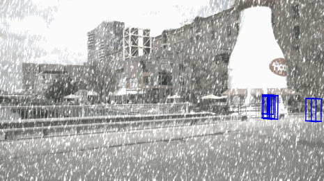 | 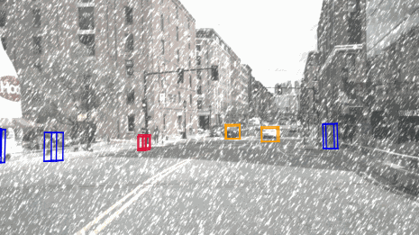 | 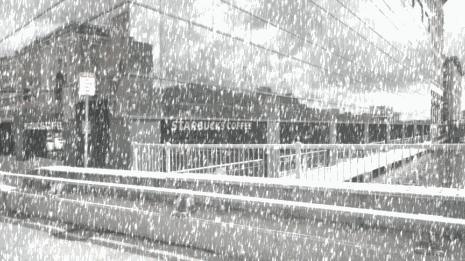 | 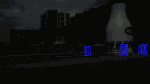 | 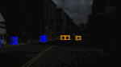 | 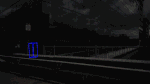 |
| 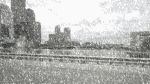  | 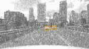  | 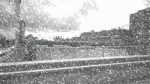  | 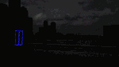  | 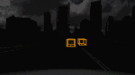  | 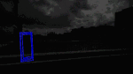  |
| BACK_LEFT  | BACK  | BACK_RIGHT  | BACK_LEFT  | BACK  | BACK_RIGHT  |
| | | | | | |

Visit our [project page](https://daniel-xsy.github.io/robobev/) to explore more examples. :blue_car:


## Updates
- [2023.06] - The nuScenes-C dataset is now available at [OpenDataLab](https://opendatalab.com/nuScenes-C)! 🚀
- [2023.04] - We establish *"Robust BEV Perception"* leaderboards on [Paper-with-Code](https://paperswithcode.com/sota/robust-camera-only-3d-object-detection-on). Join the challenge today! :raising_hand:
- [2023.02] - We invite every BEV enthusiast to participate in the *robust BEV perception* benchmark! For more details, please read [this](docs/INVITE.md) page. :beers:
- [2023.01] - Launch of `RoboBEV`! In this initial version, **11** BEV detection algorithms and **1** monocular 3D detection algorithm have been benchmarked under **8** corruption types across **3** severity levels.


## Outline
- [Installation](#installation)
- [Data Preparation](#data-preparation)
- [Getting Started](#getting-started)
- [Model Zoo](#model-zoo)
- [Robustness Benchmark](#robustness-benchmark)
- [BEV Model Calibration](#bev-model-calibration)
- [Create Corruption Set](#create-corruption-set)
- [TODO List](#todo-list)
- [Citation](#citation)
- [License](#license)
- [Acknowledgements](#acknowledgements)


## Installation
Kindly refer to [INSTALL.md](docs/INSTALL.md) for the installation details.


## Data Preparation

Our datasets are hosted by [OpenDataLab](https://opendatalab.com/).
><br>
> OpenDataLab is a pioneering open data platform for the large AI model era, making datasets accessible. By using OpenDataLab, researchers can obtain free formatted datasets in various fields.

Kindly refer to [DATA_PREPARE.md](docs/DATA_PREPARE.md) for the details to prepare the `nuScenes` and `nuScenes-C` datasets.


## Getting Started

Kindly refer to [GET_STARTED.md](docs/GET_STARTED.md) to learn more usage about this codebase.


## Model Zoo

<details open>
<summary>&nbsp<b>Camera-Only BEV Detection</b></summary>

> - [ ] **[Fast-BEV](https://arxiv.org/abs/2301.12511), arXiv 2023.** <sup>[**`[Code]`**](https://github.com/Sense-GVT/Fast-BEV)</sup>
> - [ ] **[AeDet](https://arxiv.org/abs/2211.12501), CVPR 2023.** <sup>[**`[Code]`**](https://github.com/fcjian/AeDet)</sup>
> - [x] **[SOLOFusion](https://arxiv.org/abs/2210.02443), ICLR 2023.** <sup>[**`[Code]`**](https://github.com/Divadi/SOLOFusion)</sup>
> - [x] **[PolarFormer](https://arxiv.org/abs/2206.15398), AAAI 2023.** <sup>[**`[Code]`**](https://github.com/fudan-zvg/PolarFormer)</sup>
> - [x] **[BEVStereo](https://arxiv.org/abs/2209.10248), AAAI 2023.** <sup>[**`[Code]`**](https://github.com/Megvii-BaseDetection/BEVStereo)</sup>
> - [x] **[BEVDepth](https://arxiv.org/abs/2206.10092), AAAI 2023.** <sup>[**`[Code]`**](https://github.com/Megvii-BaseDetection/BEVDepth)</sup>
> - [ ] **[MatrixVT](https://arxiv.org/abs/2211.10593), arXiv 2022.** <sup>[**`[Code]`**](https://github.com/Megvii-BaseDetection/BEVDepth)</sup>
> - [x] **[Sparse4D](https://arxiv.org/abs/2211.10581), arXiv 2022.** <sup>[**`[Code]`**](https://github.com/linxuewu/Sparse4D)</sup>
> - [ ] **[CrossDTR](https://arxiv.org/abs/2209.13507), arXiv 2022.** <sup>[**`[Code]`**](https://github.com/sty61010/CrossDTR)</sup>
> - [x] **[SRCN3D](https://arxiv.org/abs/2206.14451), arXiv 2022.** <sup>[**`[Code]`**](https://github.com/synsin0/SRCN3D)</sup>
> - [ ] **[PolarDETR](https://arxiv.org/abs/2206.10965), arXiv 2022.** <sup>[**`[Code]`**](https://github.com/hustvl/PolarDETR)</sup>
> - [x] **[BEVerse](https://arxiv.org/abs/2205.09743), arXiv 2022.** <sup>[**`[Code]`**](https://github.com/zhangyp15/BEVerse)</sup>
> - [ ] **[M^2BEV](https://arxiv.org/abs/2204.05088), arXiv 2022.** <sup>[**`[Code]`**](https://nvlabs.github.io/M2BEV/)</sup>
> - [x] **[ORA3D](https://arxiv.org/abs/2207.00865), BMVC 2022.** <sup>[**`[Code]`**](https://github.com/anonymous2776/ora3d)</sup>
> - [ ] **[Graph-DETR3D](https://arxiv.org/abs/2204.11582), ACM MM 2022.** <sup>[**`[Code]`**](https://github.com/zehuichen123/Graph-DETR3D)</sup>
> - [ ] **[SpatialDETR](https://markus-enzweiler.de/downloads/publications/ECCV2022-spatial_detr.pdf), ECCV 2022.** <sup>[**`[Code]`**](https://github.com/cgtuebingen/SpatialDETR)</sup>
> - [x] **[PETR](https://arxiv.org/abs/2203.05625), ECCV 2022.** <sup>[**`[Code]`**](https://github.com/megvii-research/PETR)</sup>
> - [x] **[BEVFormer](https://arxiv.org/abs/2203.17270), ECCV 2022.** <sup>[**`[Code]`**](https://github.com/fundamentalvision/BEVFormer)</sup>
> - [x] **[BEVDet](https://arxiv.org/abs/2112.11790), arXiv 2021.** <sup>[**`[Code]`**](https://github.com/HuangJunJie2017/BEVDet)</sup>
> - [x] **[DETR3D](https://arxiv.org/abs/2110.06922), CoRL 2021.** <sup>[**`[Code]`**](https://github.com/WangYueFt/detr3d)</sup>
</details>

<details open>
<summary>&nbsp<b>Camera-Only Monocular 3D Detection</b></summary>

> - [x] **[FCOS3D](https://openaccess.thecvf.com/content/ICCV2021W/3DODI/html/Wang_FCOS3D_Fully_Convolutional_One-Stage_Monocular_3D_Object_Detection_ICCVW_2021_paper.html), ICCVW 2021.** <sup>[**`[Code]`**](https://github.com/open-mmlab/mmdetection3d)</sup>
</details>

<details open>
<summary>&nbsp<b>LiDAR-Camera Fusion BEV Detection</b></summary>

> - [ ] **[BEVDistill](https://arxiv.org/abs/2211.09386), ICLR 2023.** <sup>[**`[Code]`**](https://github.com/zehuichen123/BEVDistill)</sup>
> - [x] **[BEVFusion](https://arxiv.org/abs/2205.13542), ICRA 2023.** <sup>[**`[Code]`**](https://github.com/mit-han-lab/bevfusion)</sup>
> - [ ] **[BEVFusion](https://arxiv.org/abs/2205.13790), NeurIPS 2022.** <sup>[**`[Code]`**](https://github.com/ADLab-AutoDrive/BEVFusion)</sup>
> - [x] **[TransFusion](https://openaccess.thecvf.com/content/CVPR2022/papers/Bai_TransFusion_Robust_LiDAR-Camera_Fusion_for_3D_Object_Detection_With_Transformers_CVPR_2022_paper.pdf), CVPR 2022.** <sup>[**`[Code]`**](https://github.com/XuyangBai/TransFusion)</sup>
> - [x] **[AutoAlignV2](https://arxiv.org/abs/2207.10316), ECCV 2022.** <sup>[**`[Code]`**](https://github.com/zehuichen123/AutoAlignV2)</sup>

</details>

<details open>
<summary>&nbsp<b>Camera-Only BEV Map Segmentation</b></summary>

> - [ ] **[LaRa](https://arxiv.org/abs/2206.13294), CoRL 2022.** <sup>[**`[Code]`**](https://github.com/valeoai/LaRa)</sup>
> - [x] **[CVT](https://arxiv.org/abs/2205.02833), CVPR 2022.** <sup>[**`[Code]`**](https://github.com/bradyz/cross_view_transformers)</sup>

</details>

<details open>
<summary>&nbsp<b>Multi-Camera Depth Estimation</b></summary>

> - [x] **[SurroundDepth](https://arxiv.org/abs/2204.03636), CoRL 2022.** <sup>[**`[Code]`**](https://github.com/weiyithu/SurroundDepth)</sup>

</details>

<details open>
<summary>&nbsp<b>Multi-Camera Semantic Occupancy Prediction</b></summary>

> - [x] **[SurroundOcc](), arXiv 2023.** <sup>[**`[Code]`**](https://github.com/weiyithu/SurroundOcc)</sup>
> - [x] **[TPVFormer](https://arxiv.org/abs/2302.07817), CVPR, 2023.** <sup>[**`[Code]`**](https://github.com/wzzheng/TPVFormer)</sup>

</details>


## Robustness Benchmark

**:triangular_ruler: Metrics:** The *nuScenes Detection Score (NDS)* is consistently used as the main indicator for evaluating model performance in our benchmark. The following two metrics are adopted to compare between models' robustness:
- **mCE (the lower the better):** The *average corruption error* (in percentage) of a candidate model compared to the baseline model, which is calculated among all corruption types across three severity levels.
- **mRR (the higher the better):** The *average resilience rate* (in percentage) of a candidate model compared to its "clean" performance, which is calculated among all corruption types across three severity levels.

**:gear: Notation:** Symbol <sup>:star:</sup> denotes the baseline model adopted in *mCE* calculation. For more detailed experimental results, please refer to [RESULTS.md](docs/RESULTS.md).

### BEV Detection

| Model | mCE (%) $\downarrow$ | mRR (%) $\uparrow$ | Clean | Cam Crash | Frame Lost | Color Quant | Motion Blur | Bright | Low Light | Fog | Snow |
| :- | :-: | :-: |:-: | :-: | :-: | :-: | :-: | :-: | :-: | :-: | :-: |
| [DETR3D](./docs/results/DETR3D.md)<sup>:star:</sup> | 100.00 | 70.77 | 0.4224 | 0.2859 | 0.2604 | 0.3177 | 0.2661 | 0.4002 | 0.2786 | 0.3912 | 0.1913 |
| |
| [DETR3D<sub>CBGS</sub>](./docs/results/DETR3D-w-cbgs.md) | 99.21 | 70.02 | 0.4341 | 0.2991  | 0.2685 | 0.3235 | 0.2542 | 0.4154 | 0.2766 | 0.4020 | 0.1925 |
| [BEVFormer<sub>Small</sub>](./docs/results/BEVFormer-Small.md) | 101.23 | 59.07 | 0.4787 | 0.2771  | 0.2459 | 0.3275 | 0.2570 | 0.3741 | 0.2413 | 0.3583 | 0.1809 |
| [BEVFormer<sub>Base</sub>](./docs/results/BEVFormer-Base.md) | 97.97 | 60.40 | 0.5174 | 0.3154 | 0.3017 | 0.3509 | 0.2695 | 0.4184 | 0.2515 | 0.4069 | 0.1857 |
| [PETR<sub>R50-p4</sub>](./docs/results/PETR-r50.md) | 111.01 | 61.26 | 0.3665 | 0.2320  | 0.2166 | 0.2472 | 0.2299 | 0.2841 | 0.1571 | 0.2876 | 0.1417 |
| [PETR<sub>VoV-p4</sub>](./docs/results/PETR-vov.md) | 100.69 | 65.03 | 0.4550 | 0.2924  | 0.2792 | 0.2968 | 0.2490 | 0.3858 | 0.2305 | 0.3703 | 0.2632 |
| [ORA3D](./docs/results/ORA3D.md) | 99.17 | 68.63 | 0.4436 | 0.3055 | 0.2750 | 0.3360 | 0.2647 | 0.4075 | 0.2613 | 0.3959 | 0.1898 |
| [BEVDet<sub>R50</sub>](./docs/results/BEVDet-r50.md) | 115.12 | 51.83 | 0.3770 | 0.2486 | 0.1924 | 0.2408 | 0.2061 | 0.2565 | 0.1102 | 0.2461 | 0.0625 |
| [BEVDet<sub>R101</sub>](./docs/results/BEVDet-r101.md) | 113.68 | 53.12 | 0.3877 | 0.2622 | 0.2065 | 0.2546 | 0.2265 | 0.2554 | 0.1118 | 0.2495 | 0.0810 |
| [BEVDet<sub>R101-pt</sub>](./docs/results/BEVDet-r101-FCOS3D-Pretrain.md) | 112.80 | 56.35 | 0.3780 | 0.2442 | 0.1962 | 0.3041 | 0.2590 | 0.2599 | 0.1398 | 0.2073 | 0.0939 |
| [BEVDet<sub>SwinT</sub>](./docs/results/BEVDet-Swin-Tiny.md) | 116.48 | 46.26 | 0.4037 | 0.2609 | 0.2115 | 0.2278 | 0.2128 | 0.2191 | 0.0490 | 0.2450 | 0.0680 |
| [BEVDepth<sub>R50</sub>](./docs/results/BEVDepth-r50.md) | 110.02  | 56.82 | 0.4058 | 0.2638 | 0.2141 | 0.2751 | 0.2513 |  0.2879 | 0.1757 | 0.2903 | 0.0863 |
| [BEVerse<sub>SwinT</sub>](./docs/results/BEVerse-Tiny.md) | 110.67 | 48.60 | 0.4665 | 0.3181 | 0.3037 | 0.2600 | 0.2647 | 0.2656 | 0.0593 | 0.2781 | 0.0644 |
| [BEVerse<sub>SwinS</sub>](./docs/results/BEVerse-Small.md) | 117.82 | 49.57 | 0.4951 | 0.3364 | 0.2485 | 0.2807 | 0.2632 | 0.3394 | 0.1118 | 0.2849 | 0.0985 |
| [PolarFormer<sub>R101</sub>](./docs/results/PolarFormer-r101.md) | 96.06 | 70.88 | 0.4602 | 0.3133 | 0.2808 | 0.3509 | 0.3221 | 0.4304 | 0.2554 | 0.4262 | 0.2304 |
| [PolarFormer<sub>VoV</sub>](./docs/results/PolarFormer-Vov.md)  | 98.75 | 67.51 | 0.4558 | 0.3135 | 0.2811 | 0.3076 | 0.2344 | 0.4280 | 0.2441 | 0.4061 | 0.2468 |
| [SRCN3D<sub>R101</sub>](./docs/results/SRCN3D-r101.md) | 99.67 | 70.23 | 0.4286 | 0.2947 | 0.2681 | 0.3318 | 0.2609 | 0.4074 | 0.2590 | 0.3940 | 0.1920 |
| [SRCN3D<sub>VoV</sub>](./docs/results/SRCN3D-Vov.md) | 102.04 | 67.95 | 0.4205 | 0.2875 | 0.2579 | 0.2827 | 0.2143 | 0.3886 | 0.2274 | 0.3774	| 0.2499 |
| [Sparse4D<sub>R101</sub>](./docs/results/Sparse4D-r101.md) | 100.01 | 55.04 | 0.5438 | 0.2873 | 0.2611 | 0.3310 | 0.2514 | 0.3984 | 0.2510 | 0.3884 | 0.2259 |
| [SOLOFusion<sub>short</sub>](./docs/results/SOLOFusion-short.md) | 108.68 | 61.45 | 0.3907 | 0.2541 | 0.2195 | 0.2804 | 0.2603 | 0.2966 | 0.2033 | 0.2998 | 0.1066 |
| [SOLOFusion<sub>long</sub>](./docs/results/SOLOFusion-Long.md) | 97.99 | 64.42 | 0.4850 | 0.3159	| 0.2490 | 0.3598 | 0.3460	| 0.4002 | 0.2814 | 0.3991 | 0.1480 |
| [SOLOFusion<sub>fusion</sub>](./docs/results/SOLOFusion.md) | 92.86 | 64.53 | 0.5381 | 0.3806 | 0.3464 | 0.4058 | 0.3642 | 0.4329 | 0.2626	 | 0.4480	 | 0.1376 |
| |
| [FCOS3D<sub>finetune</sub>](./docs/results/FCOS3D-ft.md) | 107.82 | 62.09 | 0.3949 | 0.2849 | 0.2479 | 0.2574 | 0.2570 | 0.3218 | 0.1468 | 0.3321 | 0.1136 |
| |
| [BEVFusion<sub>Cam</sub>](./docs/results/BEVFusion-Camera.md) | 109.02 | 57.81 | 0.4121 | 0.2777 | 0.2255 | 0.2763 | 0.2788 | 0.2902 | 0.1076 | 0.3041 | 0.1461 |
| [BEVFusion<sub>LiDAR</sub>](./docs/results/BEVFusion-LiDAR.md) | - | - | 0.6928 | - | - | - | - | - | - | - | - |
| [BEVFusion<sub>C+L</sub>](./docs/results/BEVFusion-Fusion.md) | 43.80 | 97.41 | 0.7138 | 0.6963 | 0.6931 | 0.7044 | 0.6977 | 0.7018 | 0.6787	 | - | - | 
| [TransFusion](./docs/results/TransFusion.md) | - | - | 0.6887 | 0.6843 | 0.6447 | 0.6819 | 0.6749 | 0.6843 | 0.6663	 | - | - | 
| [AutoAlignV2](./docs/results/AutoAlignV2.md) | - | - | 0.6139 | 0.5849 | 0.5832 | 0.6006 | 0.5901 | 0.6076 | 0.5770	 | - | - | 

### Multi-Camera Depth Estimation

| Model | Metric | Clean | Cam Crash | Frame Lost | Color Quant | Motion Blur | Bright | Low Light | Fog | Snow |
| :- | :-: | :-: |:-: | :-: | :-: | :-: | :-: | :-: | :-: | :-: |
| [SurroundDepth](./docs/results/SurroundDepth.md) | Abs Rel | 0.280 | 0.485 | 0.497 | 0.334 | 0.338 | 0.339 | 0.354 | 0.320 | 0.423 |


### Multi-Camera Semantic Occupancy Prediction

| Model | Metric | Clean | Cam Crash | Frame Lost | Color Quant | Motion Blur | Bright | Low Light | Fog | Snow |
| :- | :-: | :-: |:-: | :-: | :-: | :-: | :-: | :-: | :-: | :-: |
| [TPVFormer](./docs/results/TPVFormer.md) | mIoU vox | 52.06 | 27.39 | 22.85 | 38.16 | 38.64 | 49.00 | 37.38 | 46.69 | 19.39 |
| [SurroundOcc](./docs/results/SurroundOcc.md) | SC mIoU | 20.30 | 11.60 | 10.00 | 14.03 | 12.41 | 19.18 | 12.15 | 18.42 | 7.39 |


<p align="center"> 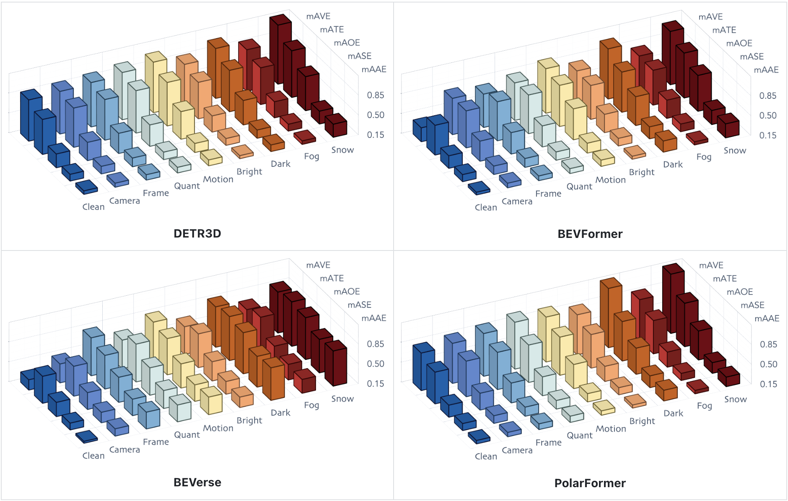 </p>


## BEV Model Calibration

| Model | Pretrain | Temporal | Depth | CBGS | Backbone | Encoder<sub>BEV</sub> | Input Size | mCE (%) | mRR (%) | NDS | 
| :- | :-: | :-: | :-: | :-: | :-: | :-: | :-: | :-: | :-: | :-: |
| [DETR3D](./docs/results/DETR3D.md) | ✓ | ✗ | ✗ | ✗ | ResNet | Attention | 1600×900 | 100.00 | 70.77 | 0.4224 | 
| [DETR3D<sub>CBGS</sub>](./docs/results/DETR3D-w-cbgs.md) | ✓ | ✗ | ✗ | ✓ | ResNet | Attention | 1600×900 | 99.21 | 70.02 | 0.4341 |
| [BEVFormer<sub>Small</sub>](./docs/results/BEVFormer-Small.md) | ✓ | ✓ | ✗ | ✗ | ResNet | Attention | 1280×720 | 101.23 | 59.07 | 0.4787 |
| [BEVFormer<sub>Base</sub>](./docs/results/BEVFormer-Base.md) | ✓ | ✓ | ✗ | ✗ | ResNet | Attention | 1600×900 | 97.97 | 60.40 | 0.5174 |
| [PETR<sub>R50-p4</sub>](./docs/results/PETR-r50.md) | ✗ | ✗ | ✗ | ✗ | ResNet | Attention | 1408×512 | 111.01 | 61.26 | 0.3665 |
| [PETR<sub>VoV-p4</sub>](./docs/results/PETR-vov.md) | ✓ | ✗ | ✗ | ✗ | VoVNet<sub>V2</sub> | Attention | 1600×900 | 100.69 | 65.03 | 0.4550 |
| [ORA3D](./docs/results/ORA3D.md) | ✓ | ✗ | ✗ | ✗ | ResNet | Attention | 1600×900 | 99.17 | 68.63 | 0.4436 |
| [PolarFormer<sub>R101</sub>](./docs/results/PolarFormer-r101.md) | ✓ | ✗ | ✗ | ✗ | ResNet | Attention | 1600×900 | 96.06  | 70.88 | 0.4602 |
| [PolarFormer<sub>VoV</sub>](./docs/results/PolarFormer-Vov.md) | ✓ | ✗ | ✗ | ✗ | VoVNet<sub>V2</sub> | Attention | 1600×900 | 98.75 | 67.51 | 0.4558 |
| |
| [SRCN3D<sub>R101</sub>](./docs/results/SRCN3D-r101.md) | ✓ | ✗ | ✗ | ✗ | ResNet | CNN+Attn. | 1600×900 | 99.67 | 70.23 | 0.4286 |
| [SRCN3D<sub>VoV</sub>](./docs/results/SRCN3D-Vov.md) | ✓ | ✗ | ✗ | ✗ | VoVNet<sub>V2</sub> | CNN+Attn. | 1600×900 | 102.04 | 67.95 | 0.4205 |
| [Sparse4D<sub>R101</sub>](./docs/results/Sparse4D-r101.md) | ✓ | ✓ | ✗ | ✗ | ResNet | CNN+Attn. | 1600×900 | 100.01 | 55.04 | 0.5438 |
| |
| [BEVDet<sub>R50</sub>](./docs/results/BEVDet-r50.md) | ✗ | ✗ | ✓ | ✓ | ResNet | CNN | 704×256 | 115.12 | 51.83 | 0.3770 |
| [BEVDet<sub>R101</sub>](./docs/results/BEVDet-r101.md) | ✗ | ✗ | ✓ | ✓ | ResNet | CNN | 704×256 | 113.68 | 53.12 | 0.3877 |
| [BEVDet<sub>R101-pt</sub>](./docs/results/BEVDet-r101-FCOS3D-Pretrain.md) | ✓ | ✗ | ✓ | ✓ | ResNet | CNN | 704×256 | 112.80 | 56.35 | 0.3780 |
| [BEVDet<sub>SwinT</sub>](./docs/results/BEVDet-Swin-Tiny.md) | ✗ | ✗ | ✓ | ✓ | Swin | CNN | 704×256 | 116.48 | 46.26 | 0.4037 |
| [BEVDepth<sub>R50</sub>](./docs/results/BEVDepth-r50.md) | ✗ | ✗ | ✓ | ✓ | ResNet | CNN | 704×256 | 110.02  | 56.82 | 0.4058 |
| [BEVerse<sub>SwinT</sub>](./docs/results/BEVerse-Tiny.md) | ✗ | ✗ | ✓ | ✓ | Swin | CNN | 704×256 | 137.25 | 28.24 | 0.1603 | 
| [BEVerse<sub>SwinT</sub>](./docs/results/BEVerse-Tiny.md) | ✗ | ✓ | ✓ | ✓ | Swin | CNN | 704×256 | 110.67 | 48.60 | 0.4665 | 
| [BEVerse<sub>SwinS</sub>](./docs/results/BEVerse-Small.md) | ✗ | ✗ | ✓ | ✓ | Swin | CNN | 1408×512 | 132.13 | 29.54 | 0.2682 |
| [BEVerse<sub>SwinS</sub>](./docs/results/BEVerse-Small.md) | ✗ | ✓ | ✓ | ✓ | Swin | CNN | 1408×512 | 117.82 | 49.57 | 0.4951 | 
| [SOLOFusion<sub>short</sub>](./docs/results/SOLOFusion-short.md) | ✗ | ✓ | ✓ | ✗ | ResNet | CNN | 704×256 | 108.68 | 61.45 | 0.3907 | 
| [SOLOFusion<sub>long</sub>](./docs/results/SOLOFusion-Long.md) | ✗ | ✓ | ✓ | ✗ | ResNet | CNN | 704×256 | 97.99 | 64.42 | 0.4850 |
| [SOLOFusion<sub>fusion</sub>](./docs/results/SOLOFusion.md) | ✗ | ✓ | ✓ | ✓ | ResNet | CNN | 704×256 | 92.86 | 64.53 | 0.5381 | 

**Note:** *Pretrain* denotes models initialized from the FCOS3D checkpoint. *Temporal* indicates whether temporal information is used. *Depth* denotes models with an explicit depth estimation branch. *CBGS* highlight models use the class-balanced group-sampling strategy.


## Create Corruption Set
You can manage to create your own "RoboBEV" corrpution sets! Follow the instructions listed in [CREATE.md](docs/CREATE.md).


## TODO List
- [x] Initial release. 🚀
- [x] Add scripts for creating common corruptions.
- [x] Add download link of nuScenes-C.
- [x] Add evaluation scripts on corruption sets.
- [x] Establish benchmark for BEV map segmentation.
- [x] Establish benchmark for multi-camera depth estimation.
- [x] Establish benchmark for multi-camera semantic occupancy prediction.
- [ ] ...


## Citation
If you find this work helpful, please kindly consider citing the following:

```bibtex
@article{xie2023robobev,
    title = {RoboBEV: Towards Robust Bird's Eye View Perception under Corruptions},
    author = {Xie, Shaoyuan and Kong, Lingdong and Zhang, Wenwei and Ren, Jiawei and Pan, Liang and Chen, Kai and Liu, Ziwei},
    journal = {arXiv preprint arXiv:2304.06719}, 
    year = {2023}
}
```
```bibtex
@misc{xie2023robobev_codebase,
    title = {The RoboBEV Benchmark for Robust Bird's Eye View Detection under Common Corruption and Domain Shift},
    author = {Xie, Shaoyuan and Kong, Lingdong and Zhang, Wenwei and Ren, Jiawei and Pan, Liang and Chen, Kai and Liu, Ziwei},
    howpublished = {\url{https://github.com/Daniel-xsy/RoboBEV}},
    year = {2023}
}
```


## License
<a rel="license" href="http://creativecommons.org/licenses/by-nc-sa/4.0/"></a>
<br />
This work is under the <a rel="license" href="http://creativecommons.org/licenses/by-nc-sa/4.0/">Creative Commons Attribution-NonCommercial-ShareAlike 4.0 International License</a>, while some specific operations in this codebase might be with other licenses. Please refer to [LICENSE.md](docs/LICENSE.md) for a more careful check, if you are using our code for commercial matters.


## Acknowledgements
This work is developed based on the [MMDetection3D](https://github.com/open-mmlab/mmdetection3d) codebase.

><br>
> MMDetection3D is an open source object detection toolbox based on PyTorch, towards the next-generation platform for general 3D detection. It is a part of the OpenMMLab project developed by MMLab.

:heart: We thank Jiangmiao Pang and Tai Wang for their insightful discussions and feedback. We thank the [OpenDataLab](https://opendatalab.com/) platform for hosting our datasets.


