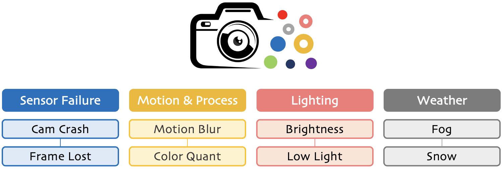

<br />
<p align="center">
  
  
  <h3 align="center"><strong>RoboDet: Robust Bird's Eye View Detection under Corruptions</strong></h3>

  <p align="center">
  </p>

</p>

<p align="center">
  <a href="" target='_blank'>
    
  </a>
  
  <a href="" target='_blank'>
    
  </a>
  
  <a href="" target='_blank'>
    
  </a>
  
  <a href="" target='_blank'>
    
  </a>
</p>


## About
`RoboDet` is the first robustness evaluation benchmark tailored for camera-based bird's eye view (BEV) detection under natural corruptions. It includes **eight corruption types** that are likely to appear in driving scenarios, ranging from <sup>1</sup>sensor failure, <sup>2</sup>motion & data processing, <sup>3</sup>lighting conditions, and <sup>4</sup>weather conditions.

| | | | | | |
| :--------: | :---: | :---------: | :--------: | :---: | :---------: |
| FRONT_LEFT | FRONT | FRONT_RIGHT | FRONT_LEFT | FRONT | FRONT_RIGHT |
|  |  |  |  |  |  |
|   |   |   |   |   |   |
| BACK_LEFT  | BACK  | BACK_RIGHT  | BACK_LEFT  | BACK  | BACK_RIGHT  |
| | | | | | |

Visit our [project page]() to explore more examples. :blue_car:


## Updates
- [2023.02] - The `nuScenes-C` dataset is ready to be downloaded! See [here](docs/DATA_PREPARE.md) for more details.
- [2023.01] - Launch of the `RoboDet` benchmark! :beers:


## Outline
- [Installation](#installation)
- [Data Preparation](#data-preparation)
- [Getting Started](#getting-started)
- [Taxonomy](#taxonomy)
- [Model Zoo](#model-zoo)
- [Benchmark](#benchmark)
- [Create Corruption Sets](#create-corruption-sets)
- [TODO List](#todo-list)
- [Citation](#citation)
- [License](#license)
- [Acknowledgements](#acknowledgements)


## Installation
Kindly refer to [INSTALL.md](docs/INSTALL.md) for the installation details.


## Data Preparation

Kindly refer to [DATA_PREPARE.md](docs/DATA_PREPARE.md) for the details to prepare the [nuScenes](https://www.nuscenes.org/nuscenes) and [nuScenes-C]() datasets.


## Getting Started

Kindly refer to [GET_STARTED.md](docs/GET_STARTED.md) to learn more usage about this codebase.


## Taxonomy

<p align="left">
 
</p>

Kindly refer to [DEMO.md](docs/DEMO.md) to explore more visual examples for each corruption type.


## Model Zoo

<details open>
<summary>&nbsp<b>Camera-Only BEV Detection</b></summary>

> - [ ] **[Fast-BEV](https://arxiv.org/abs/2301.12511), arXiv 2023.** <sup>[**`[Code]`**](https://github.com/Sense-GVT/Fast-BEV)</sup>
> - [x] **[PolarFormer](https://arxiv.org/abs/2206.15398), AAAI 2023.** <sup>[**`[Code]`**](https://github.com/fudan-zvg/PolarFormer)</sup>
> - [x] **[BEVStereo](https://arxiv.org/abs/2209.10248), AAAI 2023.** <sup>[**`[Code]`**](https://github.com/Megvii-BaseDetection/BEVStereo)</sup>
> - [x] **[BEVDepth](https://arxiv.org/abs/2206.10092), AAAI 2023.** <sup>[**`[Code]`**](https://github.com/Megvii-BaseDetection/BEVDepth)</sup>
> - [ ] **[MatrixVT](https://arxiv.org/abs/2211.10593), arXiv 2022.** <sup>[**`[Code]`**](https://github.com/Megvii-BaseDetection/BEVDepth)</sup>
> - [x] **[Sparse4D](https://arxiv.org/abs/2211.10581), arXiv 2022.** <sup>[**`[Code]`**](https://github.com/linxuewu/Sparse4D)</sup>
> - [ ] **[SOLOFusion](https://arxiv.org/abs/2210.02443), arXiv 2022.** <sup>[**`[Code]`**](https://github.com/Divadi/SOLOFusion)</sup>
> - [ ] **[CrossDTR](https://arxiv.org/abs/2209.13507), arXiv 2022.** <sup>[**`[Code]`**](https://github.com/sty61010/CrossDTR)</sup>
> - [x] **[SRCN3D](https://arxiv.org/abs/2206.14451), arXiv 2022.** <sup>[**`[Code]`**](https://github.com/synsin0/SRCN3D)</sup>
> - [ ] **[PolarDETR](https://arxiv.org/abs/2206.10965), arXiv 2022.** <sup>[**`[Code]`**](https://github.com/hustvl/PolarDETR)</sup>
> - [x] **[BEVerse](https://arxiv.org/abs/2205.09743), arXiv 2022.** <sup>[**`[Code]`**](https://github.com/zhangyp15/BEVerse)</sup>
> - [ ] **[M^2BEV](https://arxiv.org/abs/2204.05088), arXiv 2022.** <sup>[**`[Code]`**](https://nvlabs.github.io/M2BEV/)</sup>
> - [x] **[ORA3D](https://arxiv.org/abs/2207.00865), BMVC 2022.** <sup>[**`[Code]`**](https://github.com/anonymous2776/ora3d)</sup>
> - [ ] **[Graph-DETR3D](https://arxiv.org/abs/2204.11582), ACM MM 2022.** <sup>[**`[Code]`**](https://github.com/zehuichen123/Graph-DETR3D)</sup>
> - [ ] **[SpatialDETR](https://markus-enzweiler.de/downloads/publications/ECCV2022-spatial_detr.pdf), ECCV 2022.** <sup>[**`[Code]`**](https://github.com/cgtuebingen/SpatialDETR)</sup>
> - [x] **[PETR](https://arxiv.org/abs/2203.05625), ECCV 2022.** <sup>[**`[Code]`**](https://github.com/megvii-research/PETR)</sup>
> - [x] **[BEVFormer](https://arxiv.org/abs/2203.17270), ECCV 2022.** <sup>[**`[Code]`**](https://github.com/fundamentalvision/BEVFormer)</sup>
> - [x] **[BEVDet](https://arxiv.org/abs/2112.11790), arXiv 2021.** <sup>[**`[Code]`**](https://github.com/HuangJunJie2017/BEVDet)</sup>
> - [x] **[DETR3D](https://arxiv.org/abs/2110.06922), CoRL 2021.** <sup>[**`[Code]`**](https://github.com/WangYueFt/detr3d)</sup>

</details>

<details open>
<summary>&nbsp<b>LiDAR-Camera Fusion BEV Detection</b></summary>

> - [ ] **[BEVDistill](https://arxiv.org/abs/2211.09386), ICLR 2023.** <sup>[**`[Code]`**](https://github.com/zehuichen123/BEVDistill)</sup>
> - [ ] **[BEVFusion](https://arxiv.org/abs/2205.13542), ICRA 2023.** <sup>[**`[Code]`**](https://github.com/mit-han-lab/bevfusion)</sup>
> - [ ] **[BEVFusion](https://arxiv.org/abs/2205.13790), NeurIPS 2022.** <sup>[**`[Code]`**](https://github.com/ADLab-AutoDrive/BEVFusion)</sup>

</details>


## Benchmark

| Model | $\text{mCE}$ (%) | $\text{mRR}$ (%) | Clean | Cam Crash | Frame Lost | Color Quant | Motion Blur | Bright | Low Light | Fog | Snow |
| :--------------: | :-----: | :-----: |:-------: | :-------: | :------: | :------: | :------: | :------: | :------: | :------: | :------: |
| BEVFormer-Small  |         |         | $0.4787$ | $0.2771$  | $0.2459$ | $0.3275$ | $0.2570$ | $0.3741$ | $0.2851$ | $0.3583$ | $0.1809$ |
| BEVFormer-Base   |         |         | $0.5174$ | $0.3154$  | $0.3017$ | $0.3509$ | $0.2695$ | $0.4184$ | $0.2961$ | $0.4069$ | $0.1857$ |
| DETR3D           |         |         | $0.4224$ | $0.2859$  | $0.2604$ | $0.3177$ | $0.2661$ | $0.4002$ | $0.3156$ | $0.3912$ | $0.1913$ |
| DETR3D-cbgs      |         |         | $0.4341$ | $0.2991$  | $0.2685$ | $0.3235$ | $0.2542$ | $0.4154$ | $0.3233$ | $0.4020$ | $0.1925$ |
| PETR-r50-p4      |         |         | $0.3665$ | $0.2320$  | $0.2166$ | $0.2472$ | $0.2299$ | $0.2841$ | $0.1877$ | $0.2876$ | $0.1417$ |
| PETR-vov-p4      |         |         | $0.4550$ | $0.2924$  | $0.2792$ | $0.2968$ | $0.2490$ | $0.3858$ | $0.2791$ | $0.3703$ | $0.2632$ |
| BEVDet-r50       |         |         | $0.3770$ |
| BEVDepth-r50     |         |         | $0.4058$ |
| BEVerse-T        |         |         | $0.4665$ |
| BEVerse-S        |         |         | $0.4951$ |
| ORA3D            |         |         | $0.4436$ |
| PolarFormer-r101 |         |         | $0.4602$ | 
| PolarFormer-vov  |         |         | 
| SRCN3D           |         |         | 
| Sparse4D         |         |         | $0.5438$ | 

**Note:** The *nuScenes Detection Score (NDS)* is consistently used as the main indicator for evaluating model performance in our benchmark. The following two metrics are adopted to compare between models' robustness:
- **mCE:** The *average corruption error* (in percentage) of a candidate model compared to the baseline model, which is calculated among all corruption types across three severity levels.
- **mRR:** The *average resilience rate* (in percentage) of a candidate model compared to its "clean" performance, which is calculated among all corruption types across three severity levels.

For more detailed experimental results, please refer to [RESULTS.md](docs/RESULTS.md).


## Create Corruption Sets
You can manage to create your own "RoboDet" corrpution sets! Follow the instructions listed in [CREATE.md](docs/CREATE.md).


## TODO List
- [x] Initial release. 🚀
- [x] Add scripts for creating common corruptions.
- [ ] Add download link of nuScenes-C.
- [ ] Add evaluation scripts on corruption sets.
- [ ] ...


## Citation
If you find this work helpful, please kindly consider citing our paper:

```bibtex
@ARTICLE{xie2023robodet,
  title={RoboDet: Robust Bird's Eye View Detection under Corruptions},
  author={xxx},
  journal={arXiv preprint arXiv:23xx.xxxxx}, 
  year={2023},
}
```


## License
<a rel="license" href="http://creativecommons.org/licenses/by-nc-sa/4.0/"></a>
<br />
This work is under the <a rel="license" href="http://creativecommons.org/licenses/by-nc-sa/4.0/">Creative Commons Attribution-NonCommercial-ShareAlike 4.0 International License</a>, while some specific operations in this codebase might be with other licenses. Please refer to [LICENSE.md](docs/LICENSE.md) for a more careful check, if you are using our code for commercial matters.


## Acknowledgements
We thank the exceptional support from [Shanghai AI Laboratory](https://www.shlab.org.cn/)! Kindly refer to [ACKNOWLEDGE.md](docs/ACKNOWLEDGE.md) for more detailed acknowledgments of this codebase.


