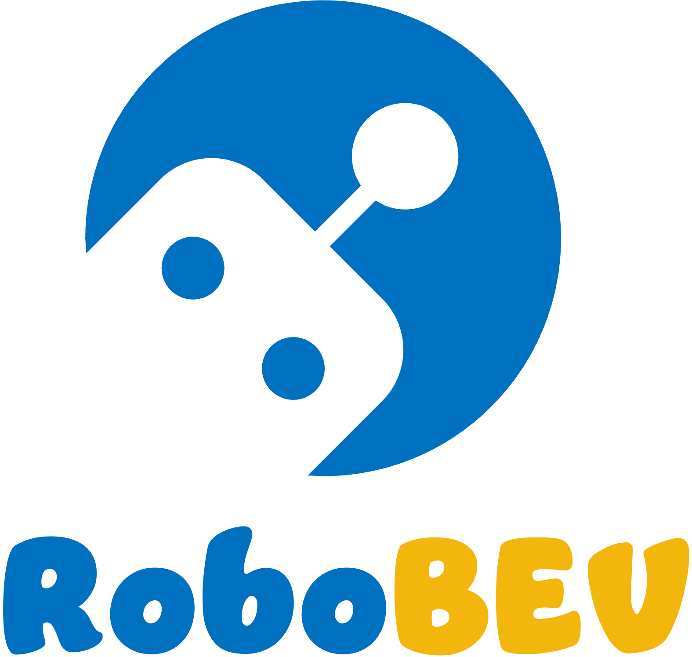
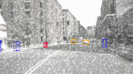

<p align="right">English | <a href="">简体中文</a></p>

<p align="center">
  
  
  <h3 align="center"><strong>RoboDet: Robust Bird's Eye View Detection under Corruptions</strong></h3>

  <p align="center">
  </p>

</p>

<p align="center">
  <a href="" target='_blank'>
    
  </a>
  
  <a href="" target='_blank'>
    
  </a>
  
  <a href="" target='_blank'>
    
  </a>
  
  <a href="" target='_blank'>
    
  </a>
</p>


## About

`RoboDet` is the first robustness evaluation benchmark tailored for camera-based bird's eye view (BEV) detection under natural corruptions. It includes **eight corruption types** that are likely to appear in driving scenarios, ranging from <sup>1</sup>sensor failure, <sup>2</sup>motion & data processing, <sup>3</sup>lighting conditions, and <sup>4</sup>weather conditions.

| | | | | | |
| :--------: | :---: | :---------: | :--------: | :---: | :---------: |
| FRONT_LEFT | FRONT | FRONT_RIGHT | FRONT_LEFT | FRONT | FRONT_RIGHT |
|  |  |  |  |  |  |
|   |   |   |   |   |   |
| BACK_LEFT  | BACK  | BACK_RIGHT  | BACK_LEFT  | BACK  | BACK_RIGHT  |
| | | | | | |

Visit our [project page]() to explore more examples. :blue_car:


## Updates
- [2023.02] - The `nuScenes-C` dataset is ready to be downloaded! See [here](docs/DATA_PREPARE.md) for more details.
- [2023.01] - Launch of the `RoboDet` benchmark! :beers:


## Outline
- [About](#about)
- [Updates](#updates)
- [Outline](#outline)
- [Installation](#installation)
- [Data Preparation](#data-preparation)
- [Getting Started](#getting-started)
- [Taxonomy](#taxonomy)
- [Model Zoo](#model-zoo)
- [Benchmark](#benchmark)
- [Create Corruption Sets](#create-corruption-sets)
- [TODO List](#todo-list)
- [Citation](#citation)
- [License](#license)
- [Acknowledgements](#acknowledgements)


## Installation
Kindly refer to [INSTALL.md](docs/INSTALL.md) for the installation details.


## Data Preparation

Kindly refer to [DATA_PREPARE.md](docs/DATA_PREPARE.md) for the details to prepare the [nuScenes](https://www.nuscenes.org/nuscenes) and [nuScenes-C]() datasets.


## Getting Started

Kindly refer to [GET_STARTED.md](docs/GET_STARTED.md) to learn more usage about this codebase.


## Taxonomy

<p align="left">
 
</p>

Kindly refer to [DEMO.md](docs/DEMO.md) to explore more visual examples for each corruption type.


## Model Zoo

<details open>
<summary>&nbsp<b>Camera-Only BEV Detection</b></summary>

> - [ ] **[Fast-BEV](https://arxiv.org/abs/2301.12511), arXiv 2023.** <sup>[**`[Code]`**](https://github.com/Sense-GVT/Fast-BEV)</sup>
> - [x] **[PolarFormer](https://arxiv.org/abs/2206.15398), AAAI 2023.** <sup>[**`[Code]`**](https://github.com/fudan-zvg/PolarFormer)</sup>
> - [x] **[BEVStereo](https://arxiv.org/abs/2209.10248), AAAI 2023.** <sup>[**`[Code]`**](https://github.com/Megvii-BaseDetection/BEVStereo)</sup>
> - [x] **[BEVDepth](https://arxiv.org/abs/2206.10092), AAAI 2023.** <sup>[**`[Code]`**](https://github.com/Megvii-BaseDetection/BEVDepth)</sup>
> - [ ] **[MatrixVT](https://arxiv.org/abs/2211.10593), arXiv 2022.** <sup>[**`[Code]`**](https://github.com/Megvii-BaseDetection/BEVDepth)</sup>
> - [x] **[Sparse4D](https://arxiv.org/abs/2211.10581), arXiv 2022.** <sup>[**`[Code]`**](https://github.com/linxuewu/Sparse4D)</sup>
> - [ ] **[SOLOFusion](https://arxiv.org/abs/2210.02443), arXiv 2022.** <sup>[**`[Code]`**](https://github.com/Divadi/SOLOFusion)</sup>
> - [ ] **[CrossDTR](https://arxiv.org/abs/2209.13507), arXiv 2022.** <sup>[**`[Code]`**](https://github.com/sty61010/CrossDTR)</sup>
> - [x] **[SRCN3D](https://arxiv.org/abs/2206.14451), arXiv 2022.** <sup>[**`[Code]`**](https://github.com/synsin0/SRCN3D)</sup>
> - [ ] **[PolarDETR](https://arxiv.org/abs/2206.10965), arXiv 2022.** <sup>[**`[Code]`**](https://github.com/hustvl/PolarDETR)</sup>
> - [x] **[BEVerse](https://arxiv.org/abs/2205.09743), arXiv 2022.** <sup>[**`[Code]`**](https://github.com/zhangyp15/BEVerse)</sup>
> - [ ] **[M^2BEV](https://arxiv.org/abs/2204.05088), arXiv 2022.** <sup>[**`[Code]`**](https://nvlabs.github.io/M2BEV/)</sup>
> - [x] **[ORA3D](https://arxiv.org/abs/2207.00865), BMVC 2022.** <sup>[**`[Code]`**](https://github.com/anonymous2776/ora3d)</sup>
> - [ ] **[Graph-DETR3D](https://arxiv.org/abs/2204.11582), ACM MM 2022.** <sup>[**`[Code]`**](https://github.com/zehuichen123/Graph-DETR3D)</sup>
> - [ ] **[SpatialDETR](https://markus-enzweiler.de/downloads/publications/ECCV2022-spatial_detr.pdf), ECCV 2022.** <sup>[**`[Code]`**](https://github.com/cgtuebingen/SpatialDETR)</sup>
> - [x] **[PETR](https://arxiv.org/abs/2203.05625), ECCV 2022.** <sup>[**`[Code]`**](https://github.com/megvii-research/PETR)</sup>
> - [x] **[BEVFormer](https://arxiv.org/abs/2203.17270), ECCV 2022.** <sup>[**`[Code]`**](https://github.com/fundamentalvision/BEVFormer)</sup>
> - [x] **[BEVDet](https://arxiv.org/abs/2112.11790), arXiv 2021.** <sup>[**`[Code]`**](https://github.com/HuangJunJie2017/BEVDet)</sup>
> - [x] **[DETR3D](https://arxiv.org/abs/2110.06922), CoRL 2021.** <sup>[**`[Code]`**](https://github.com/WangYueFt/detr3d)</sup>

</details>

<details open>
<summary>&nbsp<b>LiDAR-Camera Fusion BEV Detection</b></summary>

> - [ ] **[BEVDistill](https://arxiv.org/abs/2211.09386), ICLR 2023.** <sup>[**`[Code]`**](https://github.com/zehuichen123/BEVDistill)</sup>
> - [ ] **[BEVFusion](https://arxiv.org/abs/2205.13542), ICRA 2023.** <sup>[**`[Code]`**](https://github.com/mit-han-lab/bevfusion)</sup>
> - [ ] **[BEVFusion](https://arxiv.org/abs/2205.13790), NeurIPS 2022.** <sup>[**`[Code]`**](https://github.com/ADLab-AutoDrive/BEVFusion)</sup>

</details>


## Benchmark

| Model | mCS (%) $\uparrow$ | mRR (%) $\uparrow$ | Clean | Cam Crash | Frame Lost | Color Quant | Motion Blur | Bright | Low Light | Fog | Snow |
| -: | :-: | :-: |:-: | :-: | :-: | :-: | :-: | :-: | :-: | :-: | :-: |
| |
| <sup>:star:</sup>[DETR3D](docs/results/DETR3D.md) | 100.00 | 70.77 | 0.4224 | 0.2859 | 0.2604 | 0.3177 | 0.2661 | 0.4002 | 0.2786 | 0.3912 | 0.1913 |
| [DETR3D<sub>cbgs</sub>](docs/results/DETR3D-w-cbgs.md) | - | - | 0.4341 | 0.2991  | 0.2685 | 0.3235 | 0.2542 | 0.4154 | - | 0.4020 | 0.1925 |
| [BEVFormer<sub>Small</sub>](docs/results/BEVFormer-Small.md) | 94.66 | 59.07 | 0.4787 | 0.2771  | 0.2459 | 0.3275 | 0.2570 | 0.3741 | 0.2413 | 0.3583 | 0.1809 |
| [BEVFormer<sub>Base</sub>](docs/results/BEVFormer-Base.md) | 104.23 | 60.40 | 0.5174 | 0.3154 | 0.3017 | 0.3509 | 0.2695 | 0.4184 | 0.2515 | 0.4069 | 0.1857 |
| [PETR<sub>r50-p4</sub>](docs/results/PETR-r50.md) | 75.44 | 61.26 | 0.3665 | 0.2320  | 0.2166 | 0.2472 | 0.2299 | 0.2841 | 0.1571 | 0.2876 | 0.1417 |
| [PETR<sub>vov-p4</sub>](docs/results/PETR-vov.md) | 100.98 | 65.03 | 0.4550 | 0.2924  | 0.2792 | 0.2968 | 0.2490 | 0.3858 | 0.2305 | 0.3703 | 0.2632 |
| [BEVDet<sub>r50</sub>](docs/results//BEVDet-r50.md) | 64.16 | 51.83 | 0.3770 | 0.2486 | 0.1924 | 0.2408 | 0.2061 | 0.2565 | 0.1102 | 0.2461 | 0.0625 |
| [BEVDepth<sub>r50</sub>](docs/results/BEVDepth-r50.md) | 76.23  | 56.82 | 0.4058 | 0.2638 | 0.2141 | 0.2751 | 0.2513 |  0.2879 | 0.1757 | 0.2903 | 0.0863 |
| [BEVerse<sub>Tiny</sub>](docs/results/BEVerse-Tiny.md) | 75.20 | 48.60 | 0.4665 | 0.3181 | 0.3037 | 0.2600 | 0.2647 | 0.2656 | 0.0593 | 0.2781 | 0.0644 |
| [BEVerse<sub>Small</sub>](docs/results/BEVerse-Small.md) | 81.20 | 49.57 | 0.4951 | 0.3364 | 0.2485 | 0.2807 | 0.2632 | 0.3394 | 0.1118 | 0.2849 | 0.0985 |
| [ORA3D](docs/results/ORA3D.md) | 101.72 | 68.63 | 0.4436 | 0.3055 | 0.2750 | 0.3360 | 0.2647 | 0.4075 | 0.2613 | 0.3959 | 0.1898 |
| [PolarFormer<sub>r101</sub>](docs/results/PolarFormer-r101.md) | 109.69  | 70.88 | 0.4602 | 0.3133 | 0.2808 | 0.3509 | 0.3221 | 0.4304 | 0.2554 | 0.4262 | 0.2304 |
| [PolarFormer<sub>vov</sub>](docs/results/PolarFormer-Vov.md)  | 128.60 | 68.14 | 0.5616 | 0.3904 | 0.3593 | 0.4328 | 0.3448 | 0.5055 | 0.2719 | 0.4905 | 0.2662 |
| [SRCN3D<sub>r101</sub>](docs/results/SRCN3D-r101.md) | 100.55 | 70.23 | 0.4286 | 0.2947 | 0.2681 | 0.3318 | 0.2609 | 0.4074 | 0.2590 | 0.3940 | 0.1920 |
| [SRCN3D<sub>vov</sub>](docs/results/SRCN3D-Vov.md) | 107.88 | 68.04 | 0.4746 | 0.3288 | 0.3038 | 0.3794 | 0.2978 | 0.4323 | 0.2171 | 0.4201 | 0.2041 |
| [Sparse4D<sub>r101</sub>](docs/results/Sparse4D-r101.md) | 100.80 | 55.04 | 0.5438 | 0.2873 | 0.2611 | 0.3310 | 0.2514 | 0.3984 | 0.2510 | 0.3884 | 0.2259 |
| |
| BEVFusion<sub>Cam</sub> | - | - | 0.4121 | - | - | - | - | - | - | - | - |
| BEVFusion<sub>LiDAR</sub> | - | - | 0.6928 | - | - | - | - | - | - | - | - |
| BEVFusion<sub>C+L</sub> | - | - | 0.7138 | - | - | - | - | - | - | - | - | 


**Note:** The *nuScenes Detection Score (NDS)* is consistently used as the main indicator for evaluating model performance in our benchmark. The following two metrics are adopted to compare between models' robustness:
- **mCS (the higher the better):** The *average corruption score* (in percentage) of a candidate model compared to the baseline model, which is calculated among all corruption types across three severity levels.
- **mRR (the higher the better):** The *average resilience rate* (in percentage) of a candidate model compared to its "clean" performance, which is calculated among all corruption types across three severity levels.

Symbol <sup>:star:</sup> denotes the baseline model adopted in *mCS* calculation. For more detailed experimental results, please refer to [RESULTS.md](docs/RESULTS.md).


## Create Corruption Sets
You can manage to create your own "RoboDet" corrpution sets! Follow the instructions listed in [CREATE.md](docs/CREATE.md).


## TODO List
- [x] Initial release. 🚀
- [x] Add scripts for creating common corruptions.
- [ ] Add download link of nuScenes-C.
- [x] Add evaluation scripts on corruption sets.
- [ ] ...


## Citation
If you find this work helpful, please kindly consider citing our paper:

```bibtex
@ARTICLE{xie2023robodet,
  title={RoboDet: Robust Bird's Eye View Detection under Corruptions},
  author={xxx},
  journal={arXiv preprint arXiv:23xx.xxxxx}, 
  year={2023},
}
```


## License
<a rel="license" href="http://creativecommons.org/licenses/by-nc-sa/4.0/"></a>
<br />
This work is under the <a rel="license" href="http://creativecommons.org/licenses/by-nc-sa/4.0/">Creative Commons Attribution-NonCommercial-ShareAlike 4.0 International License</a>, while some specific operations in this codebase might be with other licenses. Please refer to [LICENSE.md](docs/LICENSE.md) for a more careful check, if you are using our code for commercial matters.


## Acknowledgements
We thank the exceptional support from [Shanghai AI Laboratory](https://www.shlab.org.cn/)! Kindly refer to [ACKNOWLEDGE.md](docs/ACKNOWLEDGE.md) for more detailed acknowledgments of this codebase.


