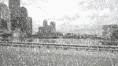
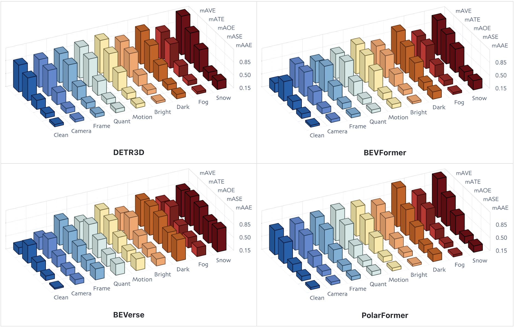

<p align="right"><a href="https://github.com/Daniel-xsy/RoboBEV">English</a> | 简体中文</p>

<p align="center">
  
  
  <h3 align="center"><strong>Towards Robust Bird's Eye View Perception under Common Corruption and Domain Shift</strong></h3>

  <p align="center">
      <a href="https://scholar.google.com/citations?user=s1m55YoAAAAJ" target='_blank'>Shaoyuan Xie</a><sup>1</sup>&nbsp;&nbsp;
      <a href="https://scholar.google.com/citations?user=-j1j7TkAAAAJ" target='_blank'>Lingdong Kong</a><sup>2,3</sup>&nbsp;&nbsp;
      <a href="https://scholar.google.com/citations?user=QDXADSEAAAAJ" target='_blank'>Wenwei Zhang</a><sup>2,4</sup>&nbsp;&nbsp;
      <a href="https://scholar.google.com/citations?user=YUKPVCoAAAAJ" target='_blank'>Jiawei Ren</a><sup>4</sup>&nbsp;&nbsp;
      <a href="https://scholar.google.com/citations?user=lSDISOcAAAAJ" target='_blank'>Liang Pan</a><sup>4</sup>&nbsp;&nbsp;
      <a href="https://scholar.google.com/citations?user=eGD0b7IAAAAJ" target='_blank'>Kai Chen</a><sup>2</sup>&nbsp;&nbsp;
      <a href="https://scholar.google.com/citations?user=lc45xlcAAAAJ" target='_blank'>Ziwei Liu</a><sup>4</sup>
    <br>
    <small><sup>1</sup>华中科技大学&nbsp;&nbsp;</small>
    <small><sup>2</sup>上海人工智能实验室&nbsp;&nbsp;</small>
    <small><sup>3</sup>新加坡国立大学&nbsp;&nbsp;</small>
    <small><sup>4</sup>南洋理工大学S-Lab</small>
  </p>

</p>

<p align="center">
  <a href="https://arxiv.org/abs/2304.06719" target='_blank'>
    
  </a>
  
  <a href="https://daniel-xsy.github.io/robobev/" target='_blank'>
    
  </a>
  
  <a href="https://daniel-xsy.github.io/robobev/" target='_blank'>
    
  </a>
  
  <a href="" target='_blank'>
    
  </a>
  
  <a href="" target='_blank'>
    
  </a>
</p>


## 项目概览

`RoboBEV` 是首个为在自然数据"损坏"和域迁移条件下, 基于相机的鸟瞰图 (BEV) 感知量身定制的鲁棒性评估基线。该基线包括了以下八种可能出现在驾驶场景中的数据"损坏"类型: <sup>1</sup>传感器故障损坏、<sup>2</sup>运动和数据处理损坏、<sup>3</sup>光照条件损坏和<sup>4</sup>天气条件损坏。

| | | | | | |
| :--------: | :---: | :---------: | :--------: | :---: | :---------: |
| 左前视角 | 前视角 | 右前视角 | 左前视角 | 前视角 | 右前视角 |
|  |  |  |  |  |  |
|   |   |   |   |   |   |
| 左后视角 | 后视角 | 右后视角 | 左后视角 | 后视角 | 右后视角 |
| | | | | | |

请参阅我们的 [项目主页](https://daniel-xsy.github.io/robobev/) 以获取更多细节与实例。 :blue_car:


## 版本更新
- [2023.06] - nuScenes-C 数据集现已发布在[OpenDataLab](https://opendatalab.com/nuScenes-C)平台！🚀
- [2023.04] - 我们在 [Paper-with-Code](https://paperswithcode.com/sota/robust-camera-only-3d-object-detection-on) 平台搭建了 *"鲁棒BEV感知"* 基线。现在就加入鲁棒性评测吧！:raising_hand:
- [2023.02] - 我们邀请每一位BEV爱好者参与到 *"鲁棒BEV感知"* 基线中来!  更多细节，请[阅读此页面](https://github.com/Daniel-xsy/RoboBEV/blob/master/docs/INVITE.md)。:beers:
- [2023.01] - 推出 "RoboBEV"! 在这个初始版本中，**11**个BEV检测算法和**1**个单目3D检测算法已经在**8**个"损坏"类型和**3**种严重程度下进行了基准测试。


## 大纲
- [安装](#安装)
- [数据准备](#数据准备)
- [开始实验](#开始实验)
- [模型库](#模型库)
- [鲁棒性基线](#鲁棒性基线)
- [BEV模型标定](#bev模型标定)
- [生成"损坏"数据](#生成损坏数据)
- [更新计划](#更新计划)
- [引用](#引用)
- [许可](#许可)
- [致谢](#致谢)


## 安装
请参阅 [安装.md](./INSTALL_CN.md) 以获取更多有关环境安装的细节。


## 数据准备

我们的数据集由 [OpenDataLab](https://opendatalab.com/) 平台搭载。
><br>
> OpenDataLab 是一个引领AI大模型时代的数据开源开放平台。OpenDataLab 为人工智能研究者提供免费开源的数据集，通过该平台，研究者可以获得格式统一的各领域经典数据集。

请参阅 [数据准备.md](./DATA_PREPARE_CN.md) 以获取更多有关准备 `nuScenes` 和 `nuScenes-C` 数据集的细节。


## 开始实验

请参阅 [开始实验.md](./GET_STARTED_CN.md) 以获取更多有关如何使用本代码库的细节。


## 模型库

<details open>
<summary>&nbsp<b>基于多视角相机的BEV检测模型</b></summary>

> - [ ] **[Fast-BEV](https://arxiv.org/abs/2301.12511), arXiv 2023.** <sup>[**`[Code]`**](https://github.com/Sense-GVT/Fast-BEV)</sup>
> - [x] **[SOLOFusion](https://arxiv.org/abs/2210.02443), ICLR 2023.** <sup>[**`[Code]`**](https://github.com/Divadi/SOLOFusion)</sup>
> - [x] **[PolarFormer](https://arxiv.org/abs/2206.15398), AAAI 2023.** <sup>[**`[Code]`**](https://github.com/fudan-zvg/PolarFormer)</sup>
> - [x] **[BEVStereo](https://arxiv.org/abs/2209.10248), AAAI 2023.** <sup>[**`[Code]`**](https://github.com/Megvii-BaseDetection/BEVStereo)</sup>
> - [x] **[BEVDepth](https://arxiv.org/abs/2206.10092), AAAI 2023.** <sup>[**`[Code]`**](https://github.com/Megvii-BaseDetection/BEVDepth)</sup>
> - [ ] **[MatrixVT](https://arxiv.org/abs/2211.10593), arXiv 2022.** <sup>[**`[Code]`**](https://github.com/Megvii-BaseDetection/BEVDepth)</sup>
> - [x] **[Sparse4D](https://arxiv.org/abs/2211.10581), arXiv 2022.** <sup>[**`[Code]`**](https://github.com/linxuewu/Sparse4D)</sup>
> - [ ] **[CrossDTR](https://arxiv.org/abs/2209.13507), arXiv 2022.** <sup>[**`[Code]`**](https://github.com/sty61010/CrossDTR)</sup>
> - [x] **[SRCN3D](https://arxiv.org/abs/2206.14451), arXiv 2022.** <sup>[**`[Code]`**](https://github.com/synsin0/SRCN3D)</sup>
> - [ ] **[PolarDETR](https://arxiv.org/abs/2206.10965), arXiv 2022.** <sup>[**`[Code]`**](https://github.com/hustvl/PolarDETR)</sup>
> - [x] **[BEVerse](https://arxiv.org/abs/2205.09743), arXiv 2022.** <sup>[**`[Code]`**](https://github.com/zhangyp15/BEVerse)</sup>
> - [ ] **[M^2BEV](https://arxiv.org/abs/2204.05088), arXiv 2022.** <sup>[**`[Code]`**](https://nvlabs.github.io/M2BEV/)</sup>
> - [x] **[ORA3D](https://arxiv.org/abs/2207.00865), BMVC 2022.** <sup>[**`[Code]`**](https://github.com/anonymous2776/ora3d)</sup>
> - [ ] **[Graph-DETR3D](https://arxiv.org/abs/2204.11582), ACM MM 2022.** <sup>[**`[Code]`**](https://github.com/zehuichen123/Graph-DETR3D)</sup>
> - [ ] **[SpatialDETR](https://markus-enzweiler.de/downloads/publications/ECCV2022-spatial_detr.pdf), ECCV 2022.** <sup>[**`[Code]`**](https://github.com/cgtuebingen/SpatialDETR)</sup>
> - [x] **[PETR](https://arxiv.org/abs/2203.05625), ECCV 2022.** <sup>[**`[Code]`**](https://github.com/megvii-research/PETR)</sup>
> - [x] **[BEVFormer](https://arxiv.org/abs/2203.17270), ECCV 2022.** <sup>[**`[Code]`**](https://github.com/fundamentalvision/BEVFormer)</sup>
> - [x] **[BEVDet](https://arxiv.org/abs/2112.11790), arXiv 2021.** <sup>[**`[Code]`**](https://github.com/HuangJunJie2017/BEVDet)</sup>
> - [x] **[DETR3D](https://arxiv.org/abs/2110.06922), CoRL 2021.** <sup>[**`[Code]`**](https://github.com/WangYueFt/detr3d)</sup>
</details>

<details open>
<summary>&nbsp<b>基于单目相机的3D物体检测模型</b></summary>

> - [x] **[FCOS3D](https://openaccess.thecvf.com/content/ICCV2021W/3DODI/html/Wang_FCOS3D_Fully_Convolutional_One-Stage_Monocular_3D_Object_Detection_ICCVW_2021_paper.html), ICCVW 2021.** <sup>[**`[Code]`**](https://github.com/open-mmlab/mmdetection3d)</sup>
</details>

<details open>
<summary>&nbsp<b>基于相机与激光雷达融合的BEV检测模型</b></summary>

> - [ ] **[BEVDistill](https://arxiv.org/abs/2211.09386), ICLR 2023.** <sup>[**`[Code]`**](https://github.com/zehuichen123/BEVDistill)</sup>
> - [x] **[BEVFusion](https://arxiv.org/abs/2205.13542), ICRA 2023.** <sup>[**`[Code]`**](https://github.com/mit-han-lab/bevfusion)</sup>
> - [ ] **[BEVFusion](https://arxiv.org/abs/2205.13790), NeurIPS 2022.** <sup>[**`[Code]`**](https://github.com/ADLab-AutoDrive/BEVFusion)</sup>
> - [x] **[TransFusion](https://openaccess.thecvf.com/content/CVPR2022/papers/Bai_TransFusion_Robust_LiDAR-Camera_Fusion_for_3D_Object_Detection_With_Transformers_CVPR_2022_paper.pdf), CVPR 2022.** <sup>[**`[Code]`**](https://github.com/XuyangBai/TransFusion)</sup>
> - [x] **[AutoAlignV2](https://arxiv.org/abs/2207.10316), ECCV 2022.** <sup>[**`[Code]`**](https://github.com/zehuichen123/AutoAlignV2)</sup>

</details>

<details open>
<summary>&nbsp<b>基于多视角相机的BEV图分割模型</b></summary>

> - [ ] **[LaRa](https://arxiv.org/abs/2206.13294), CoRL 2022.** <sup>[**`[Code]`**](https://github.com/valeoai/LaRa)</sup>
> - [x] **[CVT](https://arxiv.org/abs/2205.02833), CVPR 2022.** <sup>[**`[Code]`**](https://github.com/bradyz/cross_view_transformers)</sup>

</details>

<details open>
<summary>&nbsp<b>基于多视角相机的深度估计模型</b></summary>

> - [x] **[SurroundDepth](https://arxiv.org/abs/2204.03636), CoRL 2022.** <sup>[**`[Code]`**](https://github.com/weiyithu/SurroundDepth)</sup>

</details>

<details open>
<summary>&nbsp<b>基于多视角相机的语义占用模型</b></summary>

> - [x] **[SurroundOcc](), arXiv 2023.** <sup>[**`[Code]`**](https://github.com/weiyithu/SurroundOcc)</sup>
> - [x] **[TPVFormer](https://arxiv.org/abs/2302.07817), CVPR, 2023.** <sup>[**`[Code]`**](https://github.com/wzzheng/TPVFormer)</sup>

</details>


## 鲁棒性基线

**:triangular_ruler: 指标:** 在我们的基准中，*nuScenes Detection Score (NDS)* 被用作评价模型性能的主要指标。我们采用以下两个指标来比较模型的鲁棒性:
- **mCE (越低越好):** 候选模型的*平均损坏误差 (百分比)*，这是在三种严重程度的所有"损坏"类型中与基线模型相比计算出来的。
- **mRR (越高越好):** 候选模型的*平均复原率 (百分比)* ，这是在三种严重程度的所有"损坏"类型中与它的"干净"性能相比计算出来的。

**:gear: 注释:** 符号 <sup>:star:</sup> 表示 *mCE* 计算中采用的基线模型。更详细的实验结果，请参考 [实验结果.md](./RESULTS_CN.md).

### BEV 检测

| 模型 | mCE (%) $\downarrow$ | mRR (%) $\uparrow$ | Clean | Cam Crash | Frame Lost | Color Quant | Motion Blur | Bright | Low Light | Fog | Snow |
| :- | :-: | :-: |:-: | :-: | :-: | :-: | :-: | :-: | :-: | :-: | :-: |
| [DETR3D](./results/DETR3D.md)<sup>:star:</sup> | 100.00 | 70.77 | 0.4224 | 0.2859 | 0.2604 | 0.3177 | 0.2661 | 0.4002 | 0.2786 | 0.3912 | 0.1913 |
| |
| [DETR3D<sub>CBGS</sub>](./results/DETR3D-w-cbgs.md) | 99.21 | 70.02 | 0.4341 | 0.2991  | 0.2685 | 0.3235 | 0.2542 | 0.4154 | 0.2766 | 0.4020 | 0.1925 |
| [BEVFormer<sub>Small</sub>](./results/BEVFormer-Small.md) | 101.23 | 59.07 | 0.4787 | 0.2771  | 0.2459 | 0.3275 | 0.2570 | 0.3741 | 0.2413 | 0.3583 | 0.1809 |
| [BEVFormer<sub>Base</sub>](./results/BEVFormer-Base.md) | 97.97 | 60.40 | 0.5174 | 0.3154 | 0.3017 | 0.3509 | 0.2695 | 0.4184 | 0.2515 | 0.4069 | 0.1857 |
| [PETR<sub>R50-p4</sub>](./results/PETR-r50.md) | 111.01 | 61.26 | 0.3665 | 0.2320  | 0.2166 | 0.2472 | 0.2299 | 0.2841 | 0.1571 | 0.2876 | 0.1417 |
| [PETR<sub>VoV-p4</sub>](./results/PETR-vov.md) | 100.69 | 65.03 | 0.4550 | 0.2924  | 0.2792 | 0.2968 | 0.2490 | 0.3858 | 0.2305 | 0.3703 | 0.2632 |
| [ORA3D](./results/ORA3D.md) | 99.17 | 68.63 | 0.4436 | 0.3055 | 0.2750 | 0.3360 | 0.2647 | 0.4075 | 0.2613 | 0.3959 | 0.1898 |
| [BEVDet<sub>R50</sub>](./results/BEVDet-r50.md) | 115.12 | 51.83 | 0.3770 | 0.2486 | 0.1924 | 0.2408 | 0.2061 | 0.2565 | 0.1102 | 0.2461 | 0.0625 |
| [BEVDet<sub>R101</sub>](./results/BEVDet-r101.md) | 113.68 | 53.12 | 0.3877 | 0.2622 | 0.2065 | 0.2546 | 0.2265 | 0.2554 | 0.1118 | 0.2495 | 0.0810 |
| [BEVDet<sub>R101-pt</sub>](./results/BEVDet-r101-FCOS3D-Pretrain.md) | 112.80 | 56.35 | 0.3780 | 0.2442 | 0.1962 | 0.3041 | 0.2590 | 0.2599 | 0.1398 | 0.2073 | 0.0939 |
| [BEVDet<sub>SwinT</sub>](./results/BEVDet-Swin-Tiny.md) | 116.48 | 46.26 | 0.4037 | 0.2609 | 0.2115 | 0.2278 | 0.2128 | 0.2191 | 0.0490 | 0.2450 | 0.0680 |
| [BEVDepth<sub>R50</sub>](./results/BEVDepth-r50.md) | 110.02  | 56.82 | 0.4058 | 0.2638 | 0.2141 | 0.2751 | 0.2513 |  0.2879 | 0.1757 | 0.2903 | 0.0863 |
| [BEVerse<sub>SwinT</sub>](./results/BEVerse-Tiny.md) | 110.67 | 48.60 | 0.4665 | 0.3181 | 0.3037 | 0.2600 | 0.2647 | 0.2656 | 0.0593 | 0.2781 | 0.0644 |
| [BEVerse<sub>SwinS</sub>](./results/BEVerse-Small.md) | 117.82 | 49.57 | 0.4951 | 0.3364 | 0.2485 | 0.2807 | 0.2632 | 0.3394 | 0.1118 | 0.2849 | 0.0985 |
| [PolarFormer<sub>R101</sub>](./results/PolarFormer-r101.md) | 96.06 | 70.88 | 0.4602 | 0.3133 | 0.2808 | 0.3509 | 0.3221 | 0.4304 | 0.2554 | 0.4262 | 0.2304 |
| [PolarFormer<sub>VoV</sub>](./results/PolarFormer-Vov.md)  | 98.75 | 67.51 | 0.4558 | 0.3135 | 0.2811 | 0.3076 | 0.2344 | 0.4280 | 0.2441 | 0.4061 | 0.2468 |
| [SRCN3D<sub>R101</sub>](./results/SRCN3D-r101.md) | 99.67 | 70.23 | 0.4286 | 0.2947 | 0.2681 | 0.3318 | 0.2609 | 0.4074 | 0.2590 | 0.3940 | 0.1920 |
| [SRCN3D<sub>VoV</sub>](./results/SRCN3D-Vov.md) | 102.04 | 67.95 | 0.4205 | 0.2875 | 0.2579 | 0.2827 | 0.2143 | 0.3886 | 0.2274 | 0.3774	| 0.2499 |
| [Sparse4D<sub>R101</sub>](./results/Sparse4D-r101.md) | 100.01 | 55.04 | 0.5438 | 0.2873 | 0.2611 | 0.3310 | 0.2514 | 0.3984 | 0.2510 | 0.3884 | 0.2259 |
| [SOLOFusion<sub>short</sub>](./results/SOLOFusion-short.md) | 108.68 | 61.45 | 0.3907 | 0.2541 | 0.2195 | 0.2804 | 0.2603 | 0.2966 | 0.2033 | 0.2998 | 0.1066 |
| [SOLOFusion<sub>long</sub>](./results/SOLOFusion-Long.md) | 97.99 | 64.42 | 0.4850 | 0.3159	| 0.2490 | 0.3598 | 0.3460	| 0.4002 | 0.2814 | 0.3991 | 0.1480 |
| [SOLOFusion<sub>fusion</sub>](./results/SOLOFusion.md) | 92.86 | 64.53 | 0.5381 | 0.3806 | 0.3464 | 0.4058 | 0.3642 | 0.4329 | 0.2626	 | 0.4480	 | 0.1376 |
| |
| [FCOS3D<sub>finetune</sub>](./results/FCOS3D-ft.md) | 107.82 | 62.09 | 0.3949 | 0.2849 | 0.2479 | 0.2574 | 0.2570 | 0.3218 | 0.1468 | 0.3321 | 0.1136 |
| |
| [BEVFusion<sub>Cam</sub>](./results/BEVFusion-Camera.md) | 109.02 | 57.81 | 0.4121 | 0.2777 | 0.2255 | 0.2763 | 0.2788 | 0.2902 | 0.1076 | 0.3041 | 0.1461 |
| [BEVFusion<sub>LiDAR</sub>](./results/BEVFusion-LiDAR.md) | - | - | 0.6928 | - | - | - | - | - | - | - | - |
| [BEVFusion<sub>C+L</sub>](./results/BEVFusion-Fusion.md) | 43.80 | 97.41 | 0.7138 | 0.6963 | 0.6931 | 0.7044 | 0.6977 | 0.7018 | 0.6787	 | - | - | 
| [TransFusion](./docs/results/TransFusion.md) | - | - | 0.6887 | 0.6843 | 0.6447 | 0.6819 | 0.6749 | 0.6843 | 0.6663	 | - | - | 
| [AutoAlignV2](./results/AutoAlignV2.md) | - | - | 0.6139 | 0.5849 | 0.5832 | 0.6006 | 0.5901 | 0.6076 | 0.5770	 | - | - | 

### 多视角相机的深度估计

| Model | Metric | Clean | Cam Crash | Frame Lost | Color Quant | Motion Blur | Bright | Low Light | Fog | Snow |
| :- | :-: | :-: |:-: | :-: | :-: | :-: | :-: | :-: | :-: | :-: |
| [SurroundDepth](./docs/results/SurroundDepth.md) | Abs Rel | 0.280 | 0.485 | 0.497 | 0.334 | 0.338 | 0.339 | 0.354 | 0.320 | 0.423 |


### 多视角相机的语义占用

| Model | Metric | Clean | Cam Crash | Frame Lost | Color Quant | Motion Blur | Bright | Low Light | Fog | Snow |
| :- | :-: | :-: |:-: | :-: | :-: | :-: | :-: | :-: | :-: | :-: |
| [TPVFormer](./docs/results/TPVFormer.md) | mIoU vox | 52.06 | 27.39 | 22.85 | 38.16 | 38.64 | 49.00 | 37.38 | 46.69 | 19.39 |
| [SurroundOcc](./docs/results/SurroundOcc.md) | SC mIoU | 20.30 | 11.60 | 10.00 | 14.03 | 12.41 | 19.18 | 12.15 | 18.42 | 7.39 |

<p align="center">  </p>

## BEV模型标定

| 模型 | 预训练 | 时序建模 | 深度估计 | CBGS | 骨干网络 | BEV编码器 | 图像尺寸 | mCE (%) | mRR (%) | NDS | 
| :- | :-: | :-: | :-: | :-: | :-: | :-: | :-: | :-: | :-: | :-: |
| [DETR3D](./results/DETR3D.md) | ✓ | ✗ | ✗ | ✗ | ResNet | Attention | 1600×900 | 100.00 | 70.77 | 0.4224 | 
| [DETR3D<sub>CBGS</sub>](./results/DETR3D-w-cbgs.md) | ✓ | ✗ | ✗ | ✓ | ResNet | Attention | 1600×900 | 99.21 | 70.02 | 0.4341 |
| [BEVFormer<sub>Small</sub>](./results/BEVFormer-Small.md) | ✓ | ✓ | ✗ | ✗ | ResNet | Attention | 1280×720 | 101.23 | 59.07 | 0.4787 |
| [BEVFormer<sub>Base</sub>](./results/BEVFormer-Base.md) | ✓ | ✓ | ✗ | ✗ | ResNet | Attention | 1600×900 | 97.97 | 60.40 | 0.5174 |
| [PETR<sub>R50-p4</sub>](./results/PETR-r50.md) | ✗ | ✗ | ✗ | ✗ | ResNet | Attention | 1408×512 | 111.01 | 61.26 | 0.3665 |
| [PETR<sub>VoV-p4</sub>](./results/PETR-vov.md) | ✓ | ✗ | ✗ | ✗ | VoVNet<sub>V2</sub> | Attention | 1600×900 | 100.69 | 65.03 | 0.4550 |
| [ORA3D](./results/ORA3D.md) | ✓ | ✗ | ✗ | ✗ | ResNet | Attention | 1600×900 | 99.17 | 68.63 | 0.4436 |
| [PolarFormer<sub>R101</sub>](./results/PolarFormer-r101.md) | ✓ | ✗ | ✗ | ✗ | ResNet | Attention | 1600×900 | 96.06  | 70.88 | 0.4602 |
| [PolarFormer<sub>VoV</sub>](./results/PolarFormer-Vov.md) | ✓ | ✗ | ✗ | ✗ | VoVNet<sub>V2</sub> | Attention | 1600×900 | 98.75 | 67.51 | 0.4558 |
| |
| [SRCN3D<sub>R101</sub>](./results/SRCN3D-r101.md) | ✓ | ✗ | ✗ | ✗ | ResNet | CNN+Attn. | 1600×900 | 99.67 | 70.23 | 0.4286 |
| [SRCN3D<sub>VoV</sub>](./results/SRCN3D-Vov.md) | ✓ | ✗ | ✗ | ✗ | VoVNet<sub>V2</sub> | CNN+Attn. | 1600×900 | 102.04 | 67.95 | 0.4205 |
| [Sparse4D<sub>R101</sub>](./results/Sparse4D-r101.md) | ✓ | ✓ | ✗ | ✗ | ResNet | CNN+Attn. | 1600×900 | 100.01 | 55.04 | 0.5438 |
| |
| [BEVDet<sub>R50</sub>](./results/BEVDet-r50.md) | ✗ | ✗ | ✓ | ✓ | ResNet | CNN | 704×256 | 115.12 | 51.83 | 0.3770 |
| [BEVDet<sub>R101</sub>](./results/BEVDet-r101.md) | ✗ | ✗ | ✓ | ✓ | ResNet | CNN | 704×256 | 113.68 | 53.12 | 0.3877 |
| [BEVDet<sub>R101-pt</sub>](./results/BEVDet-r101-FCOS3D-Pretrain.md) | ✓ | ✗ | ✓ | ✓ | ResNet | CNN | 704×256 | 112.80 | 56.35 | 0.3780 |
| [BEVDet<sub>SwinT</sub>](./results/BEVDet-Swin-Tiny.md) | ✗ | ✗ | ✓ | ✓ | Swin | CNN | 704×256 | 116.48 | 46.26 | 0.4037 |
| [BEVDepth<sub>R50</sub>](./results/BEVDepth-r50.md) | ✗ | ✗ | ✓ | ✓ | ResNet | CNN | 704×256 | 110.02  | 56.82 | 0.4058 |
| [BEVerse<sub>SwinT</sub>](./results/BEVerse-Tiny.md) | ✗ | ✗ | ✓ | ✓ | Swin | CNN | 704×256 | 137.25 | 28.24 | 0.1603 | 
| [BEVerse<sub>SwinT</sub>](./results/BEVerse-Tiny.md) | ✗ | ✓ | ✓ | ✓ | Swin | CNN | 704×256 | 110.67 | 48.60 | 0.4665 | 
| [BEVerse<sub>SwinS</sub>](./results/BEVerse-Small.md) | ✗ | ✗ | ✓ | ✓ | Swin | CNN | 1408×512 | 132.13 | 29.54 | 0.2682 |
| [BEVerse<sub>SwinS</sub>](./results/BEVerse-Small.md) | ✗ | ✓ | ✓ | ✓ | Swin | CNN | 1408×512 | 117.82 | 49.57 | 0.4951 | 
| [SOLOFusion<sub>short</sub>](./results/SOLOFusion-short.md) | ✗ | ✓ | ✓ | ✗ | ResNet | CNN | 704×256 | 108.68 | 61.45 | 0.3907 | 
| [SOLOFusion<sub>long</sub>](./results/SOLOFusion-Long.md) | ✗ | ✓ | ✓ | ✗ | ResNet | CNN | 704×256 | 97.99 | 64.42 | 0.4850 |
| [SOLOFusion<sub>fusion</sub>](./results/SOLOFusion.md) | ✗ | ✓ | ✓ | ✓ | ResNet | CNN | 704×256 | 92.86 | 64.53 | 0.5381 | 

**注:** *预训练*表示从FCOS3D初始化的模型。*时序建模*表示是否使用了时间信息。*深度估计*表示具有显式深度估计分支的模型。*CBGS*表示模型使用类平衡的分组采样策略。


## 生成"损坏"数据
你可以创建你自己的 "RoboBEV" 数据集! 请参考文件：[数据生成.md](./CREATE_CN.md).


## 更新计划
- [x] 初始更新已放出. 🚀
- [x] 新增生成"损坏"数据的运行脚本.
- [x] 新增nuScenes-C数据集下载链接.
- [x] 新增模型评测的运行脚本.
- [x] 新增BEV地图分割模型.
- [x] 新增多视角深度估计模型.
- [x] 新增多视角语义分割模型.
- [ ] ...


## 引用
如果你认为这项工作对你有帮助，请考虑引用以下内容:

```bibtex
@article{xie2023robobev,
    title = {RoboBEV: Towards Robust Bird's Eye View Perception under Corruptions},
    author = {Xie, Shaoyuan and Kong, Lingdong and Zhang, Wenwei and Ren, Jiawei and Pan, Liang and Chen, Kai and Liu, Ziwei},
    journal = {arXiv preprint arXiv:2304.06719}, 
    year = {2023}
}
```
```bibtex
@misc{xie2023robobev_codebase,
    title = {The RoboBEV Benchmark for Robust Bird's Eye View Detection under Common Corruption and Domain Shift},
    author = {Xie, Shaoyuan and Kong, Lingdong and Zhang, Wenwei and Ren, Jiawei and Pan, Liang and Chen, Kai and Liu, Ziwei},
    howpublished = {\url{https://github.com/Daniel-xsy/RoboBEV}},
    year = {2023}
}
```


## 许可
<a rel="license" href="http://creativecommons.org/licenses/by-nc-sa/4.0/"></a>
<br />
这项工作是在 <a rel="license" href="http://creativecommons.org/licenses/by-nc-sa/4.0/">Creative Commons Attribution-NonCommercial-ShareAlike 4.0 International License</a> 下进行的。这个代码库中的一些模型可能是采用其他许可证。如果你将我们的代码用于商业用途， 请参考 [许可.md](./LICENSE_CN.md) 以进行更仔细的检查。

## 致谢
这项工作是基于 [MMDetection3D](https://github.com/open-mmlab/mmdetection3d) 代码库.

><br>
> MMDetection3D 是一个基于PyTorch的开源目标检测工具箱，面向下一代通用三维检测平台。它是由MMLab开发的OpenMMLab项目的一部分。

:heart: 我们感谢 Jiangmiao Pang 和 Tai Wang 的建设性的讨论和反馈，感谢 [OpenDataLab](https://opendatalab.com/) 平台托管我们的数据集。


