# Validity Assessment
### Outline
- [Study 1: Pixel Distribution](#study-1-pixel-distribution)
- [Study 2: Robust Fine-Tuning](#study-2-robust-fine-tuning)

## Study 1: Pixel Distribution
**Goal:** Assuming that a corruption simulation is realistic enough to reflect real-world situations, the distribution of a corrupted "clean" set should be similar to that of the real-world corruption set.

**Approach:** We validate this using [ACDC](https://acdc.vision.ee.ethz.ch/news) \[R1\], [nuScenes](https://www.nuscenes.org/nuscenes) \[R2\], [Cityscapes](https://www.cityscapes-dataset.com/) \[R3\], and [Foggy-Cityscapes](https://people.ee.ethz.ch/~csakarid/SFSU_synthetic/) \[R4\], since these datasets contain:
1. real-world corruption data;
2. clean data collected by the same sensor types from the same physical locations.

We simulate corruptions using "clean" images and compare the distribution patterns with their corresponding real-world corrupted data. We do this to ensure that there is no extra distribution shift from aspects like sensor difference (e.g. FOVs and resolutions) and location discrepancy (e.g. environmental and semantic changes).

| **Real Dark (ACDC-Night)** | **Real Snow (ACDC-Snow)** | **Real Dark (nuScenes-Night)** | **Real Fog (Foggy-Cityscapes)** |
| :-: | :-: | :-: | :-: | 
| 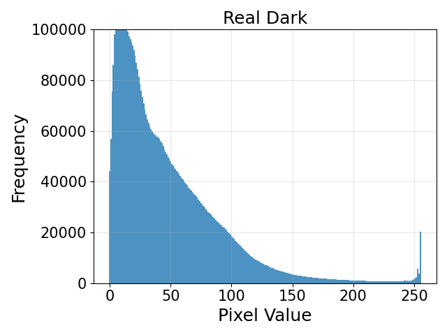 | 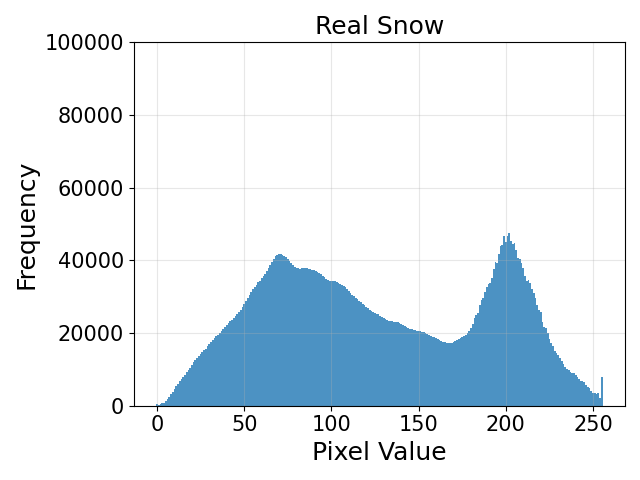 | 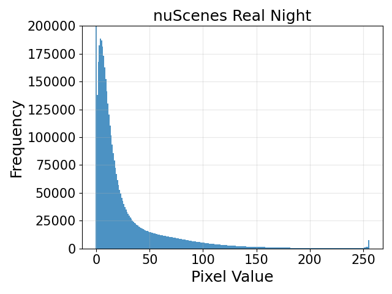 | 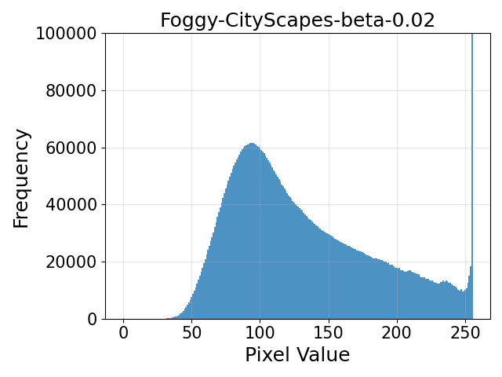 | 
| Synthetic Dark (Level 1) | Synthetic Snow (Level 1) | Synthetic Dark (Level 1) | Synthetic Fog (Level 1) |
| 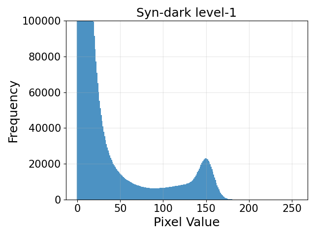 | 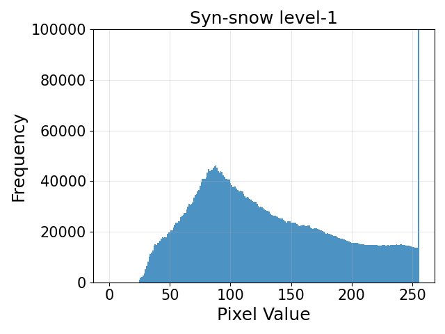 | 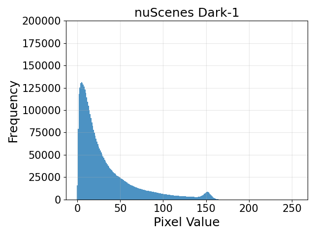 | 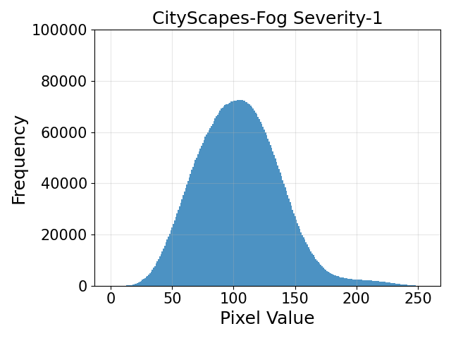 |
| Synthetic Dark (Level 2) | Synthetic Snow (Level 2) | Synthetic Dark (Level 2) | Synthetic Fog (Level 2) |
| 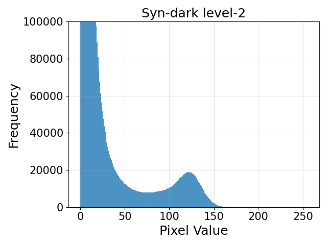 | 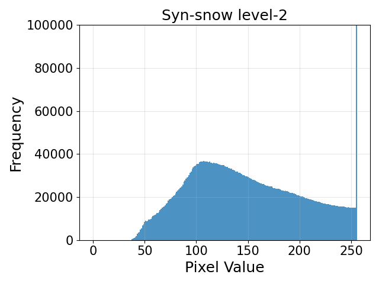 |  | 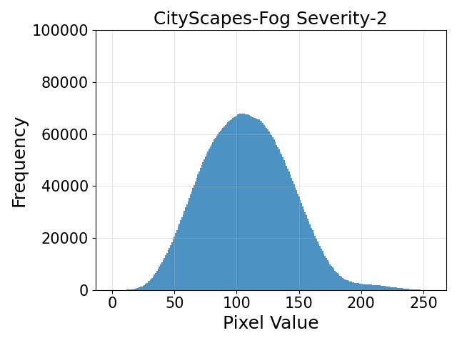 |
| Synthetic Dark (Level 3) | Synthetic Snow (Level 3) | Synthetic Dark (Level 3) | Synthetic Fog (Level 3) |
| 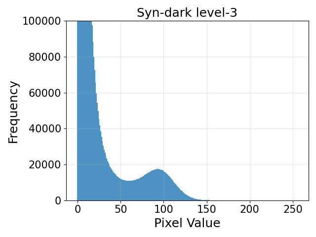 | 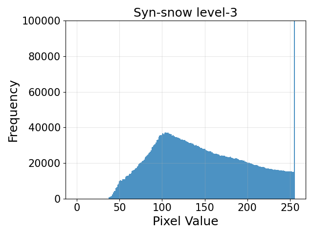 | 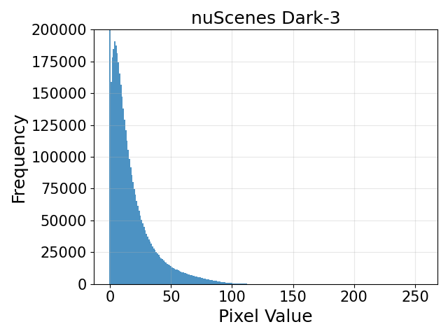 | 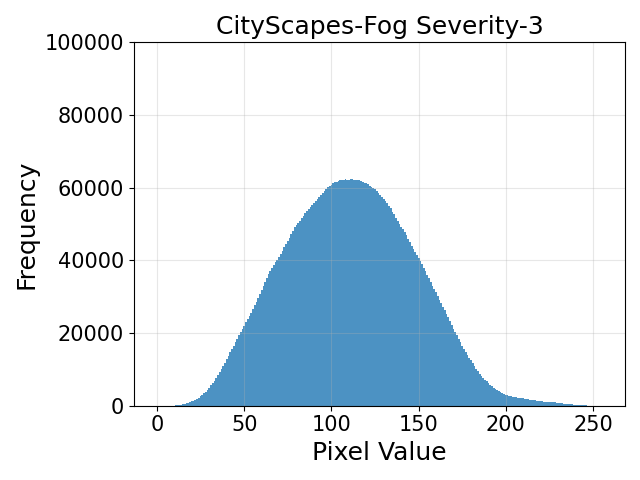 |
| Synthetic Dark (Level 4) | Synthetic Snow (Level 4) | Synthetic Dark (Level 4) | Synthetic Fog (Level 4) |
| 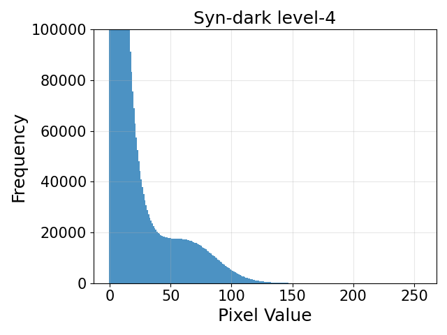 | 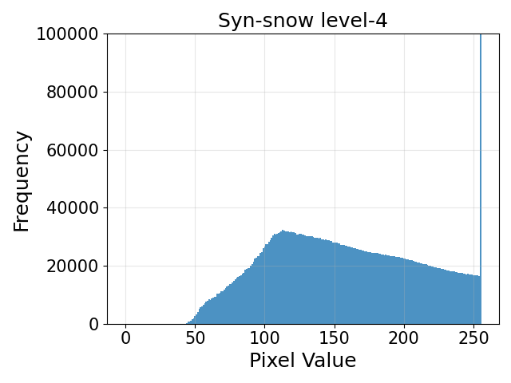 |  |  |
| Synthetic Dark (Level 5) | Synthetic Snow (Level 5) | Synthetic Dark (Level 5) | Synthetic Fog (Level 5) |
| 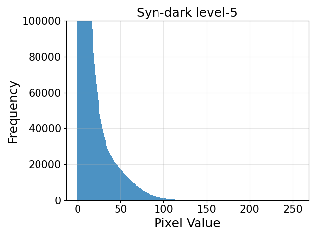 | 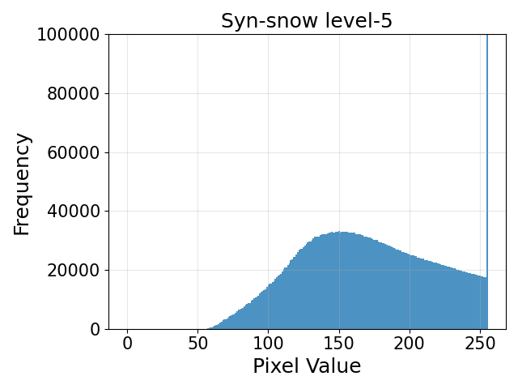 | 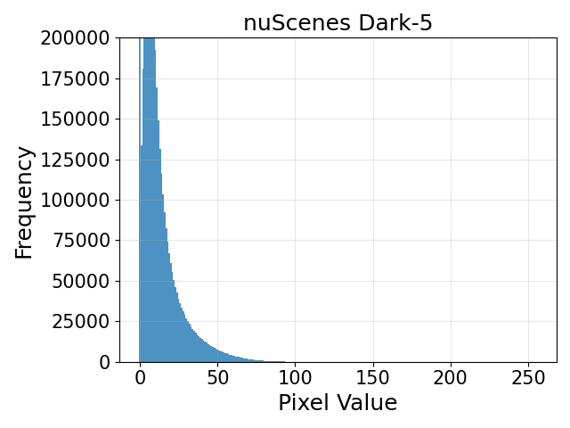 | 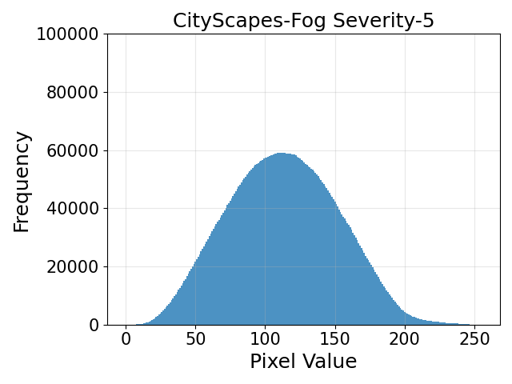 |

**References:**
- \[R1\] C. Sakaridis, D. Dai, and L. V. Gool. "ACDC: The adverse conditions dataset with correspondences for semantic driving scene understanding." ICCV, 2021.
- \[R2\] C., Holger, V. Bankiti, A. H. Lang, S. Vora, V. E. Liong, Q. Xu, A. Krishnan, Y. Pan, G. Baldan, and O. Beijbom. "nuScenes: A multimodal dataset for autonomous driving." CVPR, 2020.
- \[R3\] M. Cordts, M. Omran, S. Ramos, T. Rehfeld, M. Enzweiler, R. Benenson, U. Franke, S. Roth, and B. Schiele. "The CityScapes dataset for semantic urban scene understanding." CVPR, 2016.
- \[R4\] C. Sakaridis, D. Dai, and L. V. Gool. “Semantic foggy scene understanding with synthetic data.” IJCV, 2018.

## Study 2: Robust Fine-Tuning

**Goal:** Assuming that a corruption simulation is realistic enough to reflect real-world situations, a corruption-augmented model should achieve better generalizability than the "clean" model when tested on real-world corruption datasets. Also, the corruption-augmented model should also show better performance on clean dataset.

**Approach:** We validate this using [nuScenes](https://www.nuscenes.org/nuscenes), [nuScenes-Night](https://www.nuscenes.org/nuscenes), and [nuScenes-Rain](https://www.nuscenes.org/nuscenes). We adopt [FCOS3D]() as the baseline, and train the model with corruptions augmentation. For [nuScenes-Night](https://www.nuscenes.org/nuscenes) and [nuScenes-Rain](https://www.nuscenes.org/nuscenes), we train the model on `Day-train` and `Dry-train` train split, and evaluate on `Day-val`, `Night-val`, `Dry-val`, and `Rain-val` split.

### nuScenes

| Model  | Resolution | Corrupt Aug |   **NDS**   | **mAP** | **mATE** | **mASE** | **mAOE** | **mAVE** | **mAAE** |
| :----: | :--------: | :---------: | :---------: | :-----: | :------: | :------: | :------: | :------: | :------: |
| DETR3D | 1600 x 900 |     No      |   0.4224    | 0.3468  |  0.7647  |  0.2678  |  0.3917  |  0.8754  |  0.2108  |
| DETR3D | 1600 x 900 |     Yes     | **0.4242** | 0.35105 |  0.7655  |  0.2736  |  0.413   |  0.8487  |  0.2119  |

### nuScenes-Night

| Model  |   Split   | Resolution | Corrupt Aug |  **NDS**   | **mAP** | **mATE** | **mASE** | **mAOE** | **mAVE** | **mAAE** |
| :----: | :-------: | :--------: | :---------: | :--------: | :-----: | :------: | :------: | :------: | :------: | -------- |
| FCOS3D |  Day-val  | 1600 x 900 |     No      |   0.3867   | 0.3045  |  0.7651  |  0.2576  |  0.5001  |  1.2102  | 0.1321   |
| FCOS3D |  Day-val  | 1600 x 900 |     Yes     | **0.3883** | 0.3073  |  0.7630  |  0.2581  |  0.5043  |  1.1782  | 0.1286   |
| FCOS3D | Night-val | 1600 x 900 |     No      |   0.0854   | 0.0162  |  1.0434  |  0.6431  |  0.8241  |  1.8505  | 0.7597   |
| FCOS3D | Night-val | 1600 x 900 |     Yes     |   **0.1245**   | 0.0265  |  1.0419  |  0.4658  |  0.8145  |  2.2727  | 0.6067   |

### nuScenes-Rain

| Model  |  Split   | Resolution | Corrupt Aug |  **NDS**   | **mAP** | **mATE** | **mASE** | **mAOE** | **mAVE** | **mAAE** |
| :----: | :------: | :--------: | :---------: | :--------: | :-----: | :------: | :------: | :------: | :------: | -------- |
| FCOS3D | Dry-val  | 1600 x 900 |     No      |   0.3846   | 0.2970  |  0.7744  |  0.2541  |  0.4721  |  1.3199  | 0.1380   |
| FCOS3D | Dry-val  | 1600 x 900 |     Yes     | **0.3854** | 0.2992  |  0.7654  |  0.2582  |  0.4824  |  1.3334  | 0.1361   |
| FCOS3D | Rain-val | 1600 x 900 |     No      |   0.3203   | 0.2151  |  0.8994  |  0.2856  |  0.5253  |  1.7129  | 0.1619   |
| FCOS3D | Rain-val | 1600 x 900 |     Yes     | **0.3302** | 0.2266  |  0.8595  |  0.2719  |  0.5559  |  1.5697  | 0.1439   |
