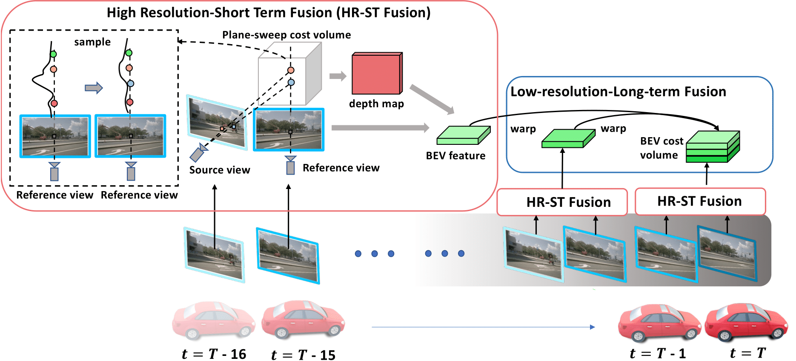

<div align="center">

# Time Will Tell: New Outlooks and A Baseline for Temporal Multi-View 3D Object Detection
</div>

<p align="center">
    
</p>

## News!
- [2023/3/14]: Code Released.
- [2022/10/6]: SOLOFusion achieves SOTA on Camera-Only [nuScenes Detection Task](https://nuscenes.org/object-detection?externalData=all&mapData=all&modalities=Camera) with **54.0% mAP** and **61.9% NDS**!
- [2022/10/5]: Paper released on [arXiv](https://arxiv.org/abs/2210.02443).

## Abstract
While recent camera-only 3D detection methods leverage multiple timesteps, the limited history they use significantly hampers the extent to which temporal fusion can improve object perception. Observing that existing works' fusion of multi-frame images are instances of temporal stereo matching, we find that performance is hindered by the interplay between 1) the low granularity of matching resolution and 2) the sub-optimal multi-view setup produced by limited history usage. Our theoretical and empirical analysis demonstrates that the optimal temporal difference between views varies significantly for different pixels and depths, making it necessary to fuse many timesteps over long-term history. Building on our investigation, we propose to generate a cost volume from a long history of image observations, compensating for the coarse but efficient matching resolution with a more optimal multi-view matching setup. Further, we augment the per-frame monocular depth predictions used for long-term, coarse matching with short-term, fine-grained matching and find that long and short term temporal fusion are highly complementary. While maintaining high efficiency, our framework sets new state-of-the-art on nuScenes, achieving first place on the test set and outperforming previous best art by **5.2\% mAP** and **3.7\% NDS** on the validation set.

## Get Started
Please see [getting_started.md](docs/getting_started.md)

## Training
By default, all configs are set-up to train with 4 GPUs, 16 samples per gpu. Please reference the configs and change as needed. Models using long-term fusion are trained in 2 phases, similar to NeuralRecon. If # of GPUs or batch size is changed, the resume_from parameter in phase2 configs must be updated.
To train R50 backbone without CBGS:

**Phase 1:**
```shell
./tools/dist_train.sh configs/solofusion/r50-fp16_phase1.py 4 --gpus 4 --autoscale-lr --no-validate
```
**Phase 2:**
```shell
./tools/dist_train.sh configs/solofusion/r50-fp16_phase2.py 4 --gpus 4 --autoscale-lr --no-validate
```
Note that `--autoscale-lr` is important.

## Inference
Our model must process data samples sequentially. This is done during training via our [custom sampler](mmdet3d/datasets/samplers/infinite_group_each_sample_in_batch_sampler.py) using IterBasedRunner but has not been adapted for inference. Thus, inference must be done on a single-gpu, single-batch size. In addition, due to some [issues in MMCV](https://github.com/open-mmlab/mmcv/issues/2195) in using EMA with IterBasedRunner, EMA weights must be transferred to main weights before inference. 

**Run the following commands:**
```shell
python tools/swap_ema_and_non_ema.py work_dirs/r50-fp16_phase2/iter_10536.pth

./tools/dist_test.sh configs/solofusion/r50-fp16_phase2.py work_dirs/r50-fp16_phase2/iter_10536_ema.pth 1 --eval bbox
```

## Model Zoo
|Method|mAP|NDS|Model|Log
|-|-|-|-|-|
|[**R50 SOLOFusion Short-Only**](configs/solofusion/r50-shortonly-fp16.py)|34.4|39.1|[Link](https://github.com/Divadi/SOLOFusion/releases/download/v0.1.0/r50-shortonly-fp16_ema.pth)|[Link](https://github.com/Divadi/SOLOFusion/releases/download/v0.1.0/r50-shortonly-fp16.log)
|[**R50 SOLOFusion Long-Only**](configs/solofusion/r50-longonly-fp16_phase2.py)|38.7|48.5|[Link](https://github.com/Divadi/SOLOFusion/releases/download/v0.1.0/r50-longonly-fp16_phase2_ema.pth)|[Link](https://github.com/Divadi/SOLOFusion/releases/download/v0.1.0/r50-longonly-fp16_phase2.log)
|[**R50 SOLOFusion**](configs/solofusion/r50-fp16_phase2.py)|40.6|49.7|[Link](https://github.com/Divadi/SOLOFusion/releases/download/v0.1.0/r50-fp16_phase2_ema.pth)|[Link](https://github.com/Divadi/SOLOFusion/releases/download/v0.1.0/r50-fp16_phase2.log)
|[**R50 SOLOFusion + CBGS**](configs/solofusion/r50-fp16_phase2.py)|43.0|53.8|[Link](https://github.com/Divadi/SOLOFusion/releases/download/v0.1.0/r50-fp16-cbgs_phase2_ema.pth)|[Link](https://github.com/Divadi/SOLOFusion/releases/download/v0.1.0/r50-fp16-cbgs_phase2.log)

## Acknowledgements
We thank numerous excellent works and open-source codebases:
- [MMDetection3D](https://github.com/open-mmlab/mmdetection3d)
- [BEVDet](https://github.com/HuangJunJie2017/BEVDet)
- [BEVDepth](https://github.com/Megvii-BaseDetection/BEVDepth)
- [BEVStereo](https://github.com/Megvii-BaseDetection/BEVStereo)
- [BEVFusion](https://github.com/mit-han-lab/bevfusion)

## BibTeX
If this work is helpful for your research, please consider citing:
```
@article{Park2022TimeWT,
  title={Time Will Tell: New Outlooks and A Baseline for Temporal Multi-View 3D Object Detection},
  author={Park, Jinhyung and Xu, Chenfeng and Yang, Shijia and Keutzer, Kurt and Kitani, Kris and Tomizuka, Masayoshi and Zhan, Wei},
  booktitle={International Conference on Learning Representations},
  year={2023}
}
```
