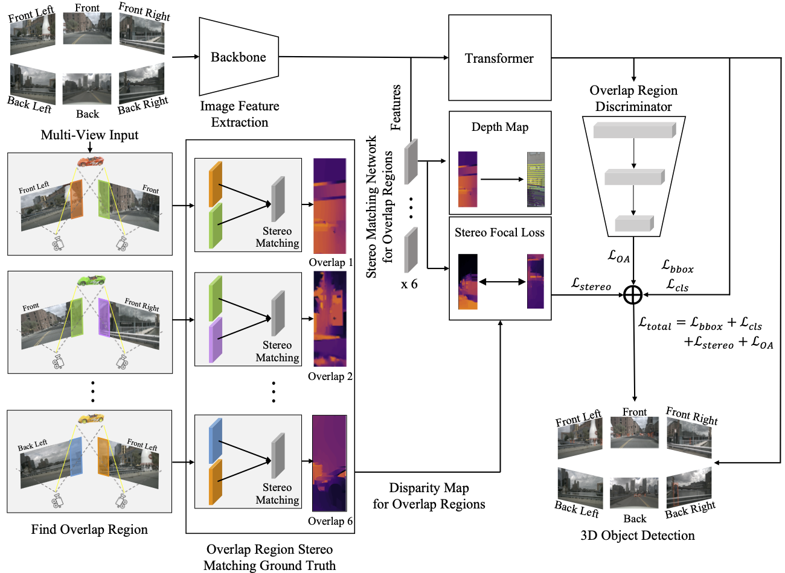

##  :car: ORA3D: Overlap Region Aware Multi-view 3D Object Detection
Official Pytorch Implementation

## :floppy_disk: Installation
For all the methods described in the paper, is it required to have:
- mmdet3d (https://github.com/open-mmlab/mmdetection3d)

## :file_folder: Dataset

- nuScenes dataset (https://www.nuscenes.org/nuscenes)

## :hammer: Training
[pretrained weight](https://drive.google.com/file/d/13CwmuASlGavjmVx9xq0VNt3Km_F3eqQ-/view?usp=sharing)

`bash ./tools/dist_train.sh <config_file> <num of GPUs> `

## :pencil: Test
`python tools/test.py <config_file> <check_point> --eval mAP`

## :golf: Results
|  Backbone   | mAP | NDS |
| :---------: | :----: |:----: |
|[ResNet101](https://drive.google.com/file/d/1jft64_8BJv3JjNrITS-f64wYcb5j3mxF/view?usp=sharing)|0.368|0.444|
|[VoVNet]()|TBD|TBD|TBD

